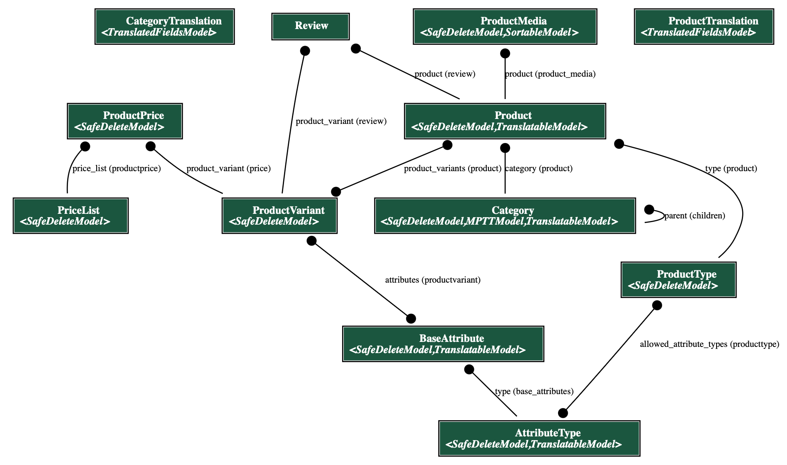
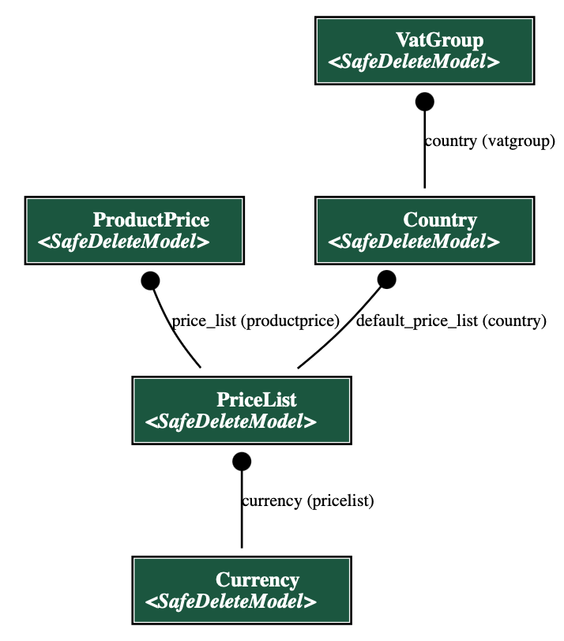

Table of contents:
* TOC
{:toc}

As mentioned in [Architecture](../architecture) section, ecoseller's backend is mainly a django application. It consists of main `core` project and following apps:
* `api` - provides logic of NotificationAPI and PaymentsAPI for integration of 3rd party payment methods and notifying external services
* `cart` - provides functionality for user's cart
* `category` - provides functionality for product categories
* `cms` - provides functionality for content pages
* `core` - main app of the project
* `country` - provides functionality for countries, addresses, shipping and billing information, currencies and VAT groups
* `emails` - provides functionality for order confirmation emails
* `order` - provides functionality for orders
* `product` - provides functionality for products and product variants
* `review` - provides functionality for product reviews
* `roles` - provides functionality for user roles and permissions
* `search` - provides functionality for searching products using ElasticSearch
* `user` - provides functionality for user related operations

To see the full core API specification, navigate to [localhost:8000/swagger/](http://localhost:8000/swagger/) (if you are running the application locally). This will open the Swagger UI, where you can see all the endpoints and their documentation. Beware that many endpoints are protected by authorization, so you will not be able to access them without a proper JWT token.

# Data models
In this section we will describe data models of the backend part of the application. To do so, we will go over various parts of system and describe them in more detail using diagrams.
To create diagrams, we used `django-extensions` app and its Graph models part, which generates a Graphviz `.dot` file from our django models. From that `.dot` file we used [GraphvizOnline](https://dreampuf.github.io/GraphvizOnline/) site to generate images of the diagrams.

The whole diagram of the models is shown below:


Due to the size of the diagram and complexity of the system, we will go over the models in smaller groups.

## Country


Above is the diagram of models with country specific data. The model is defined in `backend/core/country/models.py` file.
The main "building" block is a `Country` model which holds all the data related to countries - like name, code, language, pricelist and vat groups.
`VatGroup` itself defines binding between country and VAT percentage. 
`Currency` looks like a separate model with no relations, but it's mainly related to the `PriceList` model which will be described in a later sections.
`Address` model is used to store addresses of users and is used during checkout process or are directly bindined to `Cart` model as well as `User` model.
`ShippingInfo` and `BillingInfo` models are used to store user's shipping and billing information during checkout process. They inherit from `Address` model and add some additional fields.


## Product


Above is the diagram of models related to products and categories. The models are defined in `backend/core/product/models.py` file and are divided into 2 groups:
* **Product models** - models that are directly related to products. They are:
  * `Product` - main product model. 
  * `ProductMedia` - model for product media. It has a FK to `Product` model.
  * `ProductType` - model for product types. It defines the type of product (e.g. t-shirts, coffee, etc.). It defines allowed [`AttributeType`s](#variant-attribute-type) for product variants of this type and vat group for each country of this product.
  * `Category` - model for product categories. It's a tree structure, so it has a `parent` field which is a FK to itself.
* **Product Variant models** - models that are related to product variants. They are:
  * `ProductVariant` - main product variant model. It has a FK to `Product` model.
  * `AttributeType` <span id="variant-attribute-type"></span> - model for product variant attributes. It defines the type of attribute (e.g. color, size, etc.).
  * `BaseAttribute` - model for product variant attribute values. It defines the value of attribute (e.g. red, blue, etc.). It has a FK to `AttributeType` model.

Logic behind product variants is that each product variant has a set of attributes, which are defined by `AttributeType` model. Each attribute has a value, which is defined by `BaseAttribute` model. For example, if we have a product variant of type `t-shirt`, it will have 2 attributes: `color` and `size`. Each attribute will have a value, e.g. `color` will have values `red`, `blue`, `green`, etc. and `size` will have values `S`, `M`, `L`, etc.

## Pricelist/Currency


Above is the diagram of models related to price lists and currencies. The models are defined in `backend/core/product/models.py` and `backend/core/country/models.py` files.
Every price (`ProductPrice`) represents a price of `ProductVariant` in a `PriceList`. Where `PriceList` usually represents a specific group of prices - it might be a group of prices for a specific country or a group of prices for a specific customers (like B2B or B2C). `PriceList` is also related to `Currency` model, which defines the currency of the prices in the price list. 
The interesting part of *ecoseller* pricing logic comes as `VatGroup` model which allows you to define different VAT groups for different countries. This allows you to have different VAT value (incl. different group of VAT - reduced, standard, ...) for different countries.
With this logic, you can define a price list for a specific country and define different VAT groups for different countries. This allows you to have different prices for different countries, which is a common practice in e-commerce (for example due to different expenses for marketing, stocking, etc.).

## CMS


Above is the diagram of the CMS models with its main relations. Models are defined in `backend/core/cms/models.py` file. It allows to create content pages with different types of content. The main model is `PageCMS` model, which represents a page with content in a specific language. It contains a content field in [`editorjs` language](http://editorjs.io). `PageFrontend` is an unussual idea in ecommerce platform. Since can have some specific pages that might not be stored in the database but would be represented as a HTML/JSX page, `PageFrontend` is simply a link to that page - or, to be clear, path of that page in the frontend. Why do we need that? Imagine a situation where you simply want some extra CSS styles or some specific layout of the (landing) page. It's made directly in the frontend app and you simply store link in the database.
This is perfectly usefull if you consider other model `PageCategory` which basically puts a page in a category. This allows you to create a group of different `PageCMS` and `PageFrontned`. For example, you can create a category `Info pages` and put all your info pages in it. 
We can go a bit further and create `PageCategoryType`, which can group these categories. For example, you can create a `PageCategoryType` `Footer` and put all your categoreis that should display in footer. You can then fetch those footer specific categories and display them in the footer of your website. This is a very flexible way of creating content pages and displaying them in the frontend.

## Cart


Above is the diagram of the `Cart` model with its main relations to other models. The model is defined in `backend/core/cart/models.py` file.
The `Cart` model is used to store user's cart. It has a FK to `User` model, which binds the cart to the user. It also has a FK to `ShippingMethodCountry` and `PaymentMethodCountry` models, which are used to store user's selected shipping and payment methods. 
We also have a `CartItem` model, which represents concrete item in the cart and has a FK relation to `Cart`. Each `CartItem` also has a FK to `ProductVariant` and `Product` models, to bind the item with the concrete product.
The `Cart` model also has relations to country specific models such as `Country`, `PriceList`, `PaymentMethodCountry` and `ShippingMethodCountry` to ensure that the cart is bind to the concrete country specific data.


## Order


Once the user creates an order, new relation is created - a FK from `Order` model to `Cart`. 
We can see also another model in the diagram - `Review`, which is used to store user's reviews of products. It has a FK to `ProductVariant`, `Product` and `Order` models.
Furthermore, there's also `OrderItemComplaint` model representing complaints (either warranty claim or request for return of an item), which has FK to `CartItem` and `Order` tables.

## User


Above is the diagram of the `User` model with its main relations to other models. The model is defined in `backend/core/user/models.py` file.
In ecoseller, we replaced default django `User` model with our own `User` model in order to have more control over it. You can see that it has 2 abstract models as its parents: `AbstractBaseUser` and `PermissionsMixin`: 
* `AbstractBaseUser` is a django abstract model that provides basic user functionality
* `PermissionsMixin` is a django abstract model that provides permissions functionality.

Another authorozation related models are `Group` and `Permission` models. They are django models that are used for authorization purposes. `Group` model is used to group users into units, while `Permission` model is used to define permissions for users. More on how we handle user authorization can be found in [Authorization](../../administration/authorization) section.
Next important relation is to `Address` model. It is used to store user's address. As we can see, there is also a connection to `ShippingInfo` and `BillingInfo`, which are used during checkout process, to store user's shipping and billing information. The last relation is to `Cart` model, which binds user to his cart.

# SafeDeleteModel
Note that all ecoseller models inherit from `SafeDeleteModel` class, which looks like this:
```python
class SafeDeleteModel(models.Model):
    objects = SafeDeleteManager()
    safe_deleted = models.BooleanField(default=False)

    ...

    def delete(self, *args, **kwargs):
        self.safe_deleted = True
        self.save()

    ...      
```

We can see, that this class basically adds one field (`safe_deleted`) and overrides `delete` method.  
This way we implement safe deletion, so every time we call `delete` method on a model, it's not physically removed from the DB, rather marked as deleted.

Also note, that we also override `objects` class variable in order to return just non-deleted products when querying.

So, if you call e.g.
```python
Product.objects.all()
```

only the non-deleted products (i.e. those with `safe_deleted = False`) are returned.

# Authorization
As mentioned in [Authorization](../../administration/authorization) section, ecoseller uses roles and permissions to restrict access to certain parts of the application. 

To have better control over permissions representation and their grouping, we created 2 new models: 
* `ManagerPermission` - for permission representation. It consists of:
  * `name` - name of permission with predefined format: *\<model_name\>*_*\<permission_type\>*_permission.
  * `model` - name of model to which this permission corresponds
  * `description` - text description of permission
  * `type` - type of permission. Enum of 4 possible values:
    * `view`
    * `add`
    * `change`
    * `delete`
* `ManagerGroup` - for group representation. It consists of:
  * `name` - name of group
  * `description` - text description of group
  * `permissions` - M2M field to permissions of which this group consists.

Each group/permission should be convertable to DRF group/permission.

## RolesManager
`RolesManager` is our internal python class for handling permissions and (almost) everything related to them. It consists purely of static methods, so we can call them anywhere across the code. 

Its main usage is:
* Loading initial predefined roles from config and creating `ManagerGroup` and `ManagerPermission` objects from it
* Conversion between `DRF Group` and `ManagerGroup`, and also between `DRF Permission` and `ManagerPermission`

## Initial roles definitions and their loading
As mentioned earlier, we have [`roles.json` config](../../administration/authorization) file which has initial roles definition and [`RolesManager`](#rolesmanager) class which is responsible for loading it. We achieved this behaviour by following adjustments:
1. We created `initial_data.py` file along with `populate_groups` method in it. In this method, we :
   1. load `roles.json` config with `RolesManager` class and create instances of `ManagerGroup` and `ManagerPermission`
   2. Create DRF Groups from loaded `ManagerGroup` objects
   3. Create general DRF permissions from `app_config`
   4. Convert all DRF permissions to `ManagerPermission` objects
   5. Assign `ManagerPermission` objects to corresponding `ManagerGroup` objects
2. We put `populate_groups` method in our `user` migration file `0002_auto_20230316_1534.py` to the `operations` part - this will ensure that when this migration runs, it will also trigger `populate_groups` method

## Protecting views with permissions
In order to apply our permission restrictions, we defined two custom decorators are defined: `@check_user_access_decorator` and `@check_user_is_staff_decorator` (their definition can be found in `backend/core/roles/decorator.py`).

## `@check_user_access_decorator`
The decorator is used mainly for `POST`, `PUT` and `DELETE` views.
It checks if the user has the permission to perform the action. If the user has the permission, the view is executed. Otherwise, the view returns `403` status code.
### Parameters
- `permissions`: Set of permissions that the user needs to have to access view

### Usage example
To check whether the user has `product_change_permission` permission for accessing `put` method, put decorator above the method:
```python
    @check_user_access_decorator({"product_change_permission"})
    def put(self, request, id):
        return super().put(request, id)
```

## `@check_user_is_staff_decorator`
The decorator is used mainly for `GET` views. It checks if the user is staff (`is_staff` field in `User` model). If the user is staff, the view is executed. Otherwise, the view returns `403` status code.

### Parameters
- None: The decorator does not take any parameters

### Usage example
To check whether the user is staff for accessing `get` method, put decorator above the method:
```python
    @check_user_is_staff_decorator()
    def get(self, request, id):
        return super().get(request, id)
```

# Email sending
Important part of an e-commerce application is sending emails to users. In ecoseller, we use build in `django.core.mail` module for sending emails. 
However there's a sophisticated logic behind it, which is described below. It allows us to have DRY code and to have better control over email sending process which are passed through our Djagno RQ.
## SMTP settings
In order to send emails, it's necessary to have SMTP server and provide configuration for it. It's done in `backend/core/settings.py` file via `EMAIL_*` variables that can be passed through environment variables.
```env
EMAIL_USE_SSL=1
EMAIL_PORT=465
EMAIL_HOST=smtp.example.com
EMAIL_HOST_USER=yourusername
EMAIL_HOST_PASSWORD=yourpassword
EMAIL_FROM=Example<example@example.com>
```

## Email templates & objects
We've created `Email` object in `backend/core/emails/email/base.py` file which is used as a base class for all email objects.

### Email templates
We make usage of Django templating system for rendering email templates. All email templates are located in `backend/core/templates/email` directory. Each email template has its own HTML file with variables that are rendered with context generated by `generate_context` method of `Email` object.

### Email translation
You can, of course translate email templates and strings contained in it. It's done using Django `` tag in the template.
With that included we can use  ``  tag provided by Django to translate strings. For more information about Django translation, please refer to [Django documentation](https://docs.djangoproject.com/en/4.2/topics/i18n/translation/) and for generating translation files, please refer to [**ecoseller** administrative documentation](../administration/localization.md).

### Email objects

The `Email` objects that serves as a base class for all emails has following methods and attributes:
* `generate_context` - method for generating context for email template. It's used for rendering email template with context.
* `generate_subject` - method for generating email subject. It's used for generating email subject.
* `send` - method for sending email. It's used for sending email with rendered template and generated subject to the user. If object property `use_rq` is set to `True`, it will send email via RQ. Otherwise, it will send email synchronously.
* `send_at` - method for sending email at specific time. It's used for sending email with rendered template and generated subject to the user at specific time. If object property `use_rq` is set to `True`, it will send email via RQ. Otherwise, it won't be sent.
* `use_rq` - property for determining whether email should be sent via RQ or not. It's set to `False` by default. 
* `recepient_list` - property for determining recepients of the email. It's set to `[]` by default.
* `language` - property for determining language of the email. It's set to `cs` by default and can use only `settings.PARLER_LANGUAGES`

### Pre-defined email objects
**ecoseller** has pre-defined email objects that are used for sending emails to users. They are located in `backend/core/emails/email` directory. 

#### OrderItemComplaintConfirmationEmail
This email is sent to the user when they create a complaint for an order item. It's used for confirming that the complaint was created successfully.

#### OrderItemComplaintStatusUpdateEmail
This email is sent to the user when the status of their complaint is updated. It's used for informing the user about the status of their complaint.

#### EmailOrderConfirmation
This email is sent to the user when they create an order. It's used for confirming that the order was created successfully.

#### EmailOrderReview
This email is sent to the user 14 days after the order was created. It's used for asking the user to review the order.

Let's dive into the code of `EmailOrderReview` object to see how it works:
```python
class EmailOrderReview(Email):
    template_path = "email/generic_email.html"

    def __init__(self, order, recipient_list=[], use_rq=False):
        self.order = order
        self.language = order.cart.country.locale
        self.recipient_list = recipient_list
        self.use_rq = use_rq
        self.meta = {
            "order": self.order.pk,
            "type": "order_review",
            "language": self.language,
            "recipient_list": self.recipient_list,
        }

    def generate_subject(self):
        translation.activate(self.language)
        self.subject = _("Review your order")

    def generate_context(self):
        translation.activate(self.language)
        storefront_url = settings.STOREFRONT_URL
        self.context = {
            "main_title": _("Please review your order"),
            "subtitle": _("Hello,"),
            "body": _("We would like to ask you to review your order. "),
            "button_title": _("Review your order"),
            "button_link": f"{storefront_url}/review/{self.order.token}",
        }
```

As you can see, the `EmailOrderReview` object has `template_path` property set to `email/generic_email.html`. It means that the email will be rendered with `email/generic_email.html` template. Based on the `generate_context` method we can see that email will render with following context:
```python
{
    "main_title": _("Please review your order"),
    "subtitle": _("Hello,"),
    "body": _("We would like to ask you to review your order. "),
    "button_title": _("Review your order"),
    "button_link": f"{storefront_url}/review/{self.order.token}",
}
```
We can see that the context contains `button_link` variable which is used for generating button in the email. The button will have `Review your order` title and will redirect the user to the `storefront_url` with `/review/{self.order.token}` path.

`generic_email.html` can be used for multiple usecases - for informational email or for email with CTA button. It's up to you how you use it.

### Sending emails
There're situations when we need to send emails to users. For example, when the user creates an order, we need to send them an email with order confirmation. For that, we use `EmailOrderConfirmation` object. But how and where do we call it?
For this purpose, we've [`NotificationsAPI`](../administration/administration.md#configuring-notification-api-configuration) which is used to react to events that happen in the system. For example, when the user creates an order, we call `ORDER_SAVE` event and send `order` object as a payload. Then, via proper configuration, we can call `backend/core/api/notifications/connectors/email.py` which will send `EmailOrderConfirmation` object to the user based on `send_order_confirmation` passed from `backend/core/config/notifications.json` as `method` to the `type` `EMAIL`.
```json
"ORDER_SAVE": [
    {
      "type": "EMAIL",
      "method": "send_order_confirmation"
    }, 
    ...
  ],
```

# Product filtering & ordering
In this chapter, we'll describe product filtering and ordering, which is used for storefront, in more detail.

First of all, it's important to mention several important things
- On the storefront category page, products are displayed, however attributes (and therefore filters) are assigned to product variants. So, the filtering is done in a following way:  
**A product matches the filters if there's at least 1 of its variants matching them.**
- In Core, there are 2 endpoints for getting the products in a given category:
  - GET `category/storefront/<int:pk>/products/` -- used for initial getting of the products (with no filters selected)
  - POST `category/storefront/<int:pk>/products/` -- used for getting products with filtering & order selected. It's neccessary to pass the object containing selected filters and ordering in the request body. 
  Note that this object can be possible quite complex, so we decided to implement it using POST method and pass the data in request body, instead of another GET.
- Both filtering and ordering is done using DB queries, in order to optimize the performance.

When filtering products (using the POST request mentioned before), you should pass JSON with the following structure in a body:

```json
{
  "filters":{
    "numeric": [...],
    "textual": [...],
  },
  "sort_by": "...",
  "order': "...'
}
```

- `filters` -- contains serialized filters
- `sort_by` -- denotes a value which should be used for ordering products
- `order` -- denotes ordering of products (ascending/descending), possible values are: `asc` (default) and `desc`

We're going to describe `sort_by` field in more detail, because the logic is a little bit more complex here.  
That's because we often want to sort products by a value, that's not directly present in `Product` or `ProductVariant` objects (e.g. *title*, which is stored in multiple translations or *price*, which is stored in a separate object `ProductPrice`, as you can see [here](#product)).
 
We decided to implement ordering in a following way:  
`CategoryDetailProductsStorefrontView` contains static property `SORT_FIELDS_CONFIG`, which contains configuration of possible orderings and looks as follows:

```python
SORT_FIELDS_CONFIG = {
  "title": {
      "sort_function": _order_by_title,
      "additional_params": [locale],
  },
  "price": {
      "sort_function": _order_by_price,
      "additional_params": [pricelist],
  },
  "recommended": {
      "sort_function": _order_by_recommendation,
      "additional_params": [recommendations],
  }
]
```

We see that there are 3 possible orderings:
- by title
- by price
- by recommendation

Each of the possible orderings needs to have configured
- `sort_function` -- reference to function used for sorting by this value
- `additional_params` -- array of additional parameters that are passed to the sort function, except the list of products and ordering type (asc/desc) which are passed always. You can omit this field if there are no additional params, the default value -- empty list will be used

Then, the sort function looks like this:

```python
def _order_by_price(products, is_reverse_order, pricelist: PriceList):
    """
    Extend product query by extra field with lowest price of the product's variant prices
    """

    products = products.annotate(
        price=Subquery(
            ProductPrice.objects.filter(
                product_variant__in=OuterRef("product_variants"),
                price_list__code=pricelist.code,
            )
            .order_by("price")
            .values("price")[:1]
        )
    ).order_by("price" if not is_reverse_order else "-price")
    return products
```

We see that the function above sorts the products by their price; note that it contains an extra parameter (`pricelist`), which was specified in `additional_params`.  
Again, it's important to mention that **the first 2 arguments (`products` and `is_reverse_order`) are passed to any sort function.**

If your goal is to add another product ordering, you need to firstly implement a sort function in a similar way as above and then add it to `SORT_FIELDS_CONFIG` as well.

Also note, that on storefront, filters for each category are stored in [session storage](https://developer.mozilla.org/en-US/docs/Web/API/Window/sessionStorage), so when an user e.g. filters the products, goes to product detail page and then back, the same filters as before are applied.
