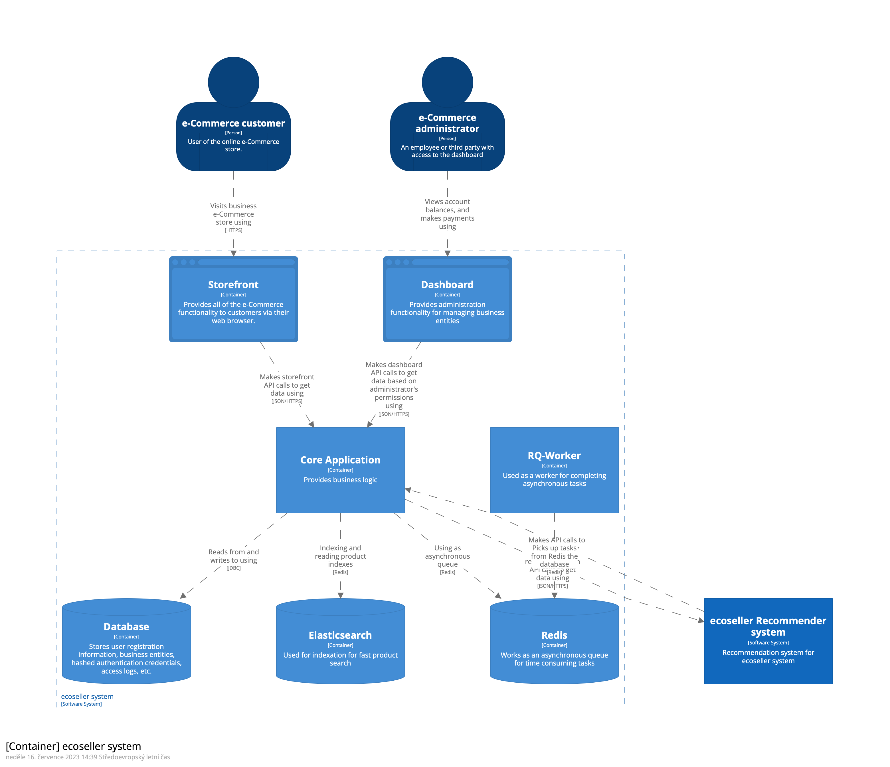

Table of contents:
* TOC
{:toc}

# Technical design

The Ecoseller system is built upon an architecture incorporating various services and technologies to deliver a powerful e-commerce platform. This section provides an overview of the technical design of the **ecoseller** system, highlighting the key components and their interactions.

## Backend written in Django:
The core of the **ecoseller**v system is the backend, developed using the Django Rest Framework. Django provides a solid foundation for building web applications and offers a range of features such as user management, data modeling, and API development. The backend handles crucial functionalities like product management, order processing, user authentication, and more.
## PostgreSQL Database:
**ecoseller** utilizes a PostgreSQL database to store and manage data efficiently. PostgreSQL is a reliable and feature-rich open-source database that ensures data integrity, scalability, and performance for the platform. It handles critical data related to products, orders, user information, and various other entities within the system.
## Storefront and Dashboard written in Next.js:
The **ecoseller** platform includes two user-facing interfaces: the storefront and the dashboard. Both are developed using Next.js, a powerful React framework. Next.js enables the creation of dynamic, high-performance web applications with server-side rendering and optimized client-side navigation. The storefront serves as the online storefront for customers, while the dashboard provides a comprehensive administration panel for managing the e-commerce platform.
## Elasticsearch for Fast Product Search:
**ecoseller** integrates Elasticsearch, a powerful search and analytics engine, to enhance the speed and accuracy of product searches. Elasticsearch enables efficient indexing, querying, and filtering of product data, ensuring a seamless and responsive search experience for users. The integration with Django allows for easy synchronization of product data between the backend and Elasticsearch.
## Redis for Asynchronous Tasks via RQ-Worker:
**ecoseller** utilizes Redis, an in-memory data structure store, to support asynchronous task processing. The RQ (Redis Queue) library leverages Redis to manage and distribute tasks across workers. The RQ-Worker, an instance of the Ecoseller backend, processes tasks from the Redis queue, enabling efficient handling of background processes and time-consuming operations.
## Recommender System written in Flask:
**ecoseller** incorporates a recommender system to provide personalized product recommendations to users. The recommender system is developed using Flask, a lightweight Python web framework. It leverages user behavior and preferences to generate relevant recommendations, enhancing the user experience and driving engagement.

The technical design of the **ecoseller** system seamlessly integrates these components, ensuring efficient data management, reliable operations, and a delightful user experience. By combining the power of Django, PostgreSQL, Next.js, Elasticsearch, Redis, and Flask, Ecoseller delivers a feature-rich and scalable e-commerce platform for businesses of all sizes with modern technologies.

 
## Backend
We can divide the backend part into several subsections based on the area it handles.
### Core Application
Core part of the application will be implemented in Python using the following technologies:
* `Django Rest Framework` – open source Python web framework
* `Redis` – open source data store that will help us with server-side caching and back-end task queuing
* `Elasticsearch` – search and analytic engine

## Recommender System
The recommender system will be implemented in Python, the following tech- nologies will be used as well:
* `Flask` – open source Python web framework
* `NumPy` – open source Python library used to work with vectors and matrices
* `TensorFlow` – open source Python library used for machine learning

## Database
For storing all product, order and customer data, we will be using `PostreSQL` relational database

## Front-end
Front-end part will be implemented with Next.js – open source `React` framework combined with `TypeScript`.

## Deployment
For easier, more flexible and scalable deployment, we will use `Docker` for containerization of our entire system.

## Version control
As a version control system, we decided to go with the current state-of-the- art `git`. More specifically, as our hosting platform, we chose `GitHub`.

## Coding style
We use several tools for enforcing our code style. In both the dashboard and the storefront, we use:
* `Prettier` – an opinionated code formatter with support for many languages, including `JavaScript` and `TypeScript`
* `ESLint` – a static analysis tool identifying problematic patterns found in `JavaScript` and `TypeScript` code
  
Similarly, in `Core` component (which is written in `Python`) we use `black` code formatter and `flake8` linter.
This way, we ensure consistent formatting of our code and avoid common bugs, which can be found by static analysis tools. We further use these tools in our Continuous integration setup, as described in [Contribution - Continuous integration](../../contribution#continuous-integration) section.

# Architecture
describe architecture (probably using C4 diagrams)

# Links