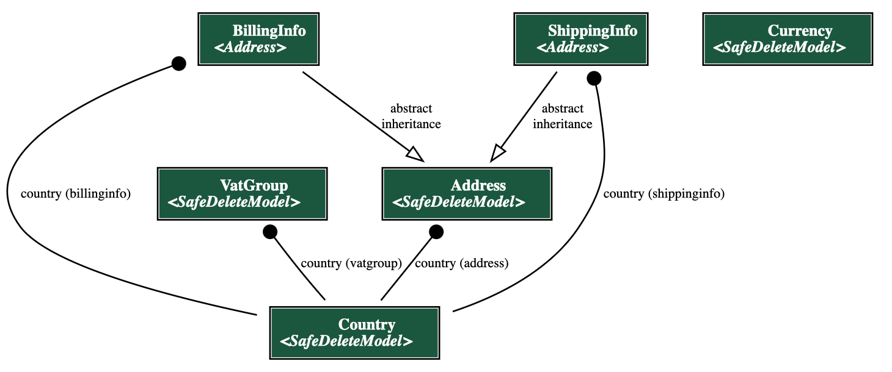
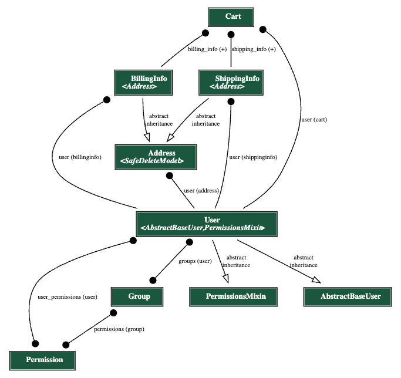

# Architecture
describe architecture (probably using C4 diagrams)
# Backend

## Data models
In this section we will describe data models of the backend part of the application. To do so, we will go over various parts of system and describe them in more detail using diagrams.
To create diagrams, we used `django-extensions` app and its Graph models part, which generates a Graphviz `.dot` file from our django models. From that `.dot` file we used [GraphvizOnline](https://dreampuf.github.io/GraphvizOnline/) site to generate images of the diagrams.

### Country


Above is the diagram of models with country specific data. The model is defined in `backend/core/country/models.py` file.
The main "building" block is a `Country` model which holds all the data related to countries - like name, code, language, pricelist and vat groups.
`VatGroup` itself defines binding between country and VAT percentage. 
`Currency` looks like a separate model with no relations, but it's mainly related to the `PriceList` model which will be described in a later sections.
`Address` model is used to store addresses of users and is used during checkout process or are directly bindined to `Cart` model as well as `User` model.
`ShippingInfo` and `BillingInfo` models are used to store user's shipping and billing information during checkout process. They inherit from `Address` model and add some additional fields.


### Product


Above is the diagram of models related to products and categories. The models are defined in `backend/core/product/models.py` file and are divided into 2 groups:
* **Product models** - models that are directly related to products. They are:
  * `Product` - main product model. 
  * `ProductMedia` - model for product media. It has a FK to `Product` model.
  * `ProductType` - model for product types. It defines the type of product (e.g. t-shirts, coffee, etc.). It defines allowed [`AttributeType`s](#variant-attribute-type) for product variants of this type and vat group for each country of this product.
  * `Category` - model for product categories. It's a tree structure, so it has a `parent` field which is a FK to itself.
* **Product Variant models** - models that are related to product variants. They are:
  * `ProductVariant` - main product variant model. It has a FK to `Product` model.
  * `AttributeType` <span id="variant-attribute-type"></span> - model for product variant attributes. It defines the type of attribute (e.g. color, size, etc.).
  * `BaseAttribute` - model for product variant attribute values. It defines the value of attribute (e.g. red, blue, etc.). It has a FK to `AttributeType` model.

Logic behind product variants is that each product variant has a set of attributes, which are defined by `AttributeType` model. Each attribute has a value, which is defined by `BaseAttribute` model. For example, if we have a product variant of type `t-shirt`, it will have 2 attributes: `color` and `size`. Each attribute will have a value, e.g. `color` will have values `red`, `blue`, `green`, etc. and `size` will have values `S`, `M`, `L`, etc.

### Pricelist/Currency


Above is the diagram of models related to price lists and currencies. The models are defined in `backend/core/product/models.py` and `backend/core/country/models.py` files.
Every price (`ProductPrice`) represents a price of `ProductVariant` in a `PriceList`. Where `PriceList` usually represents a specific group of prices - it might be a group of prices for a specific country or a group of prices for a specific customers (like B2B or B2C). `PriceList` is also related to `Currency` model, which defines the currency of the prices in the price list. 
The interesting part of *ecoseller* pricing logic comes as `VatGroup` model which allows you to define different VAT groups for different countries. This allows you to have different VAT value (incl. different group of VAT - reduced, standard, ...) for different countries.
With this logic, you can define a price list for a specific country and define different VAT groups for different countries. This allows you to have different prices for different countries, which is a common practice in e-commerce (for example due to different expenses for marketing, stocking, etc.).

### CMS


Above is the diagram of the CMS models with its main relations. Models are defined in `backend/core/cms/models.py` file. It allows to create content pages with different types of content. The main model is `PageCMS` model, which represents a page with content in a specific language. It contains a content field in [`editorjs` language](http://editorjs.io). `PageFrontend` is an unussual idea in ecommerce platform. Since can have some specific pages that might not be stored in the database but would be represented as a HTML/JSX page, `PageFrontend` is simply a link to that page - or, to be clear, path of that page in the frontend. Why do we need that? Imagine a situation where you simply want some extra CSS styles or some specific layout of the (landing) page. It's made directly in the frontend app and you simply store link in the database.
This is perfectly usefull if you consider other model `PageCategory` which basically puts a page in a category. This allows you to create a group of different `PageCMS` and `PageFrontned`. For example, you can create a category `Info pages` and put all your info pages in it. 
We can go a bit further and create `PageCategoryType`, which can group these categories. For example, you can create a `PageCategoryType` `Footer` and put all your categoreis that should display in footer. You can then fetch those footer specific categories and display them in the footer of your website. This is a very flexible way of creating content pages and displaying them in the frontend.

### User


Above is the diagram of the `User` model with its main relations to other models. The model is defined in `backend/core/user/models.py` file.
In ecoseller, we replaced default django `User` model with our own `User` model in order to have more control over it. You can see that it has 2 abstract models as its parents: `AbstractBaseUser` and `PermissionsMixin`: 
* `AbstractBaseUser` is a django abstract model that provides basic user functionality
* `PermissionsMixin` is a django abstract model that provides permissions functionality.

Another authorozation related models are `Group` and `Permission` models. They are django models that are used for authorization purposes. `Group` model is used to group users into units, while `Permission` model is used to define permissions for users. More on how we handle user authorization can be found in [Authorization](../../administration/authorization) section.
Next important relation is to `Address` model. It is used to store user's address. As we can see, there is also a connection to `ShippingInfo` and `BillingInfo`, which are used during checkout process, to store user's shipping and billing information. The last relation is to `Cart` model, which binds user to his cart.


## Authorization
As mentioned in [Authorization](../../administration/authorization) section, ecoseller uses roles and permissions to restrict access to certain parts of the application. 

To have better control over permissions representation and their grouping, we created 2 new models: 
* `ManagerPermission` - for permission representation. It consists of:
  * `name` - name of permission with predefined format: *\<model_name\>*_*\<permission_type\>*_permission.
  * `model` - name of model to which this permission corresponds
  * `description` - text description of permission
  * `type` - type of permission. Enum of 4 possible values:
    * `view`
    * `add`
    * `change`
    * `delete`
* `ManagerGroup` - for group representation. It consists of:
  * `name` - name of group
  * `description` - text description of group
  * `permissions` - M2M field to permissions of which this group consists.

Each group/permission should be convertable to DRF group/permission.

### RolesManager
`RolesManager` is our internal python class for handling permissions and (almost) everything related to them. It consists purely of static methods, so we can call them anywhere across the code. 

Its main usage is:
* Loading initial predefined roles from config and creating `ManagerGroup` and `ManagerPermission` objects from it
* Conversion between `DRF Group` and `ManagerGroup`, and also between `DRF Permission` and `ManagerPermission`

### Initial roles definitions and their loading
As mentioned earlier, we have [`roles.json` config](../../administration/authorization) file which has initial roles definition and [`RolesManager`](#rolesmanager) class which is responsible for loading it. We achieved this behaviour by following adjustments:
1. We created `initial_data.py` file along with `populate_groups` method in it. In this method, we :
   1. load `roles.json` config with `RolesManager` class and create instances of `ManagerGroup` and `ManagerPermission`
   2. Create DRF Groups from loaded `ManagerGroup` objects
   3. Create general DRF permissions from `app_config`
   4. Convert all DRF permissions to `ManagerPermission` objects
   5. Assign `ManagerPermission` objects to corresponding `ManagerGroup` objects
2. We put `populate_groups` method in our `user` migration file `0002_auto_20230316_1534.py` to the `operations` part - this will ensure that when this migration runs, it will also trigger `populate_groups` method

### Protecting views with permissions
In order to apply our permission restrictions, we defined two custom decorators are defined: `@check_user_access_decorator` and `@check_user_is_staff_decorator` (their definition can be found in `backend/core/roles/decorator.py`).

### `@check_user_access_decorator`
The decorator is used mainly for `POST`, `PUT` and `DELETE` views.
It checks if the user has the permission to perform the action. If the user has the permission, the view is executed. Otherwise, the view returns `403` status code.
#### Parameters
- `permissions`: Set of permissions that the user needs to have to access view

#### Usage example
To check whether the user has `product_change_permission` permission for accessing `put` method, put decorator above the method:
```python
    @check_user_access_decorator({"product_change_permission"})
    def put(self, request, id):
        return super().put(request, id)
```

### `@check_user_is_staff_decorator`
The decorator is used mainly for `GET` views. It checks if the user is staff (`is_staff` field in `User` model). If the user is staff, the view is executed. Otherwise, the view returns `403` status code.

#### Parameters
- None: The decorator does not take any parameters

#### Usage example
To check whether the user is staff for accessing `get` method, put decorator above the method:
```python
    @check_user_is_staff_decorator()
    def get(self, request, id):
        return super().get(request, id)
```

# Frontend

## Context providers
To be able to access various data in different parts of the application, we use React Context. More information about React Context can be found on the following links:
* [Passing data deeply with context](https://react.dev/learn/passing-data-deeply-with-context)
* [useContext](https://react.dev/reference/react/useContext)

In further parts of this section, we assume that the reader is familiar with React Context and its usage from the links above.

In ecoseller, we use various context providers, and now we will describe them in more detail.

### UserProvider
`UserProvider` is a context provider that provides information about the currently logged in user to its children. It is used in both `Dashboard` and `Storefront` component, although they differ a bit in data they provide.

#### Parameters
- `children`: React component that is wrapped by the provider

#### Return value
- `user`: fetched data from `/user/detail/` endpoint. Consists of:
    - `email` - email of the user
    - `first_name` - first name of the user
    - `last_name` - last name of the user
    - `birth_date` - birth date of the user
    - `is_active` - whether the user is active
    - `is_admin` - whether the user is admin
    - `is_staff` - whether the user is staff
- `roles`: fetched data from `/roles/user-groups/${email}`. Consists of:
    - `name` - name of the role
    - `description` - description of the role
    - `permissions` - list of permissions of the role. Each permission consists of:
        - `name` - name of the permission
        - `description` - description of the permission
        - `type` - type of the permission
        - `model` - model to which the permission corresponds

`UserProvider` in `Storefront` only provides `user` data, while `Dashboard` provides both `user` and `roles` data.

#### Usage example
`UserProvider` already wraps whole application in both `Dashboard` and `Storefront` components, so we can access user data in any child component. To access user data, we use `useUser` hook:

- In dashboard:
```typescript
const ChildComponent = () => {
    ...
    const { user, roles } = useUser();
    ...
    return (
        ...
    );
};
```
- In storefront:
```typescript
const ChildComponent = () => {
    ...
    const { user } = useUser();
    ...
    return (
        ...
    );
};
```


### PermissionProvider
As mentioned in [Authorization](../../administration/authorization) section, ecoseller uses roles and permissions to restrict access to certain parts of the application. `PermissionProvider` is a context provider that provides information about user's permissions to its children. It is used in `Dashboard` component.

To ensure proper usage, we defined `ContextPermissions` type with permissions that may be passed to the provider. The type is defined in `dashboard/utils/context/permission.tsx` file.

#### Parameters
- `allowedPermissions`: Array of `ContextPermissions` - permissions the user needs to have to gain access to the component
- `children`: React component that is wrapped by the provider

#### Return value
- `hasPermission`: boolean - true if the user has all permissions from `allowedPermissions` array, false otherwise

#### Usage example
To check whether the user has `user_add_permission` permission for adding new user, wrap the component with `PermissionProvider`:
```typescript
    <PermissionProvider allowedPermissions={["user_add_permission"]}>
        <EditableContentWrapper>
            <CreateUser />
        </EditableContentWrapper>
    </PermissionProvider>
```
Now, we can check in respective component whether the user has the permission:
```typescript
    const CreateUser () => {
        ...
        const { hasPermission } = usePermission();
        ...
        return (
            ...
            <TextField
                disabled={!hasPermission}
            >
            Email
            </TextField>
            ...
        );
    };
```
```typescript
const EditableContentWrapper = () => {
    ...
    const { hasPermission } = usePermission();
    ...
    return (
        ...
        <Button
            disabled={!hasPermission}
        >
        Save
        </Button>
        ...
    );
};
```
This will disable the `TextField` and `Button` components if the user does not have `user_add_permission` permission.


### CartProvider
`CartProvider` is a context provider that provides information about the user's cart as well as some usefull functions to its children. It is used only in `Storefront` component.

#### Parameters
- `children`: React component that is wrapped by the provider

#### Return value
- `cart`: fetched data from `/cart/storefront/<str:token>` endpoint. Consists of:
    - `token` - token of the cart
    - `cart_items` - items of the cart
    - `update_at` - date of the last update of the cart
    - `total_items_price_incl_vat_formatted` - total price of the cart including VAT
    - `total_items_price_without_vat_formatted` - total price of the cart without VAT
    - `total_price_incl_vat_formatted` - total price of the cart including VAT and shipping
    - `total_price_without_vat_formatted` - total price of the cart without VAT and shipping
    - `shipping_method_country` - id to `ShippingMethodCountry` object
    - `payment_method_country` - id to `PaymentMethodCountry` object
- `cartSize`: number of items in the cart
- `addToCart` - function for adding item to the cart
- `removeFromCart` - function for removing item from the cart
- `updateQueantity` - function for updating quantity of the item in the cart
- `clearCart` - function for clearing the cart
- `cartProductQuantity` - function for getting quantity of the product in the cart

#### Functions provided by `CartProvider`
##### `addToCart`
Adds item to the cart. If the item is already in the cart, it updates its quantity.
Takes following parameters:
* `sku`: SKU of the product
* `qty`: quantity of the product
* `product`: product ID
* `pricelist`: pricelist ID
* `country`: country ID

##### `removeFromCart`
Deletes item from the cart. Takes following parameters:
* `sku`: SKU of the product

##### `updateQuantity`
Updates quantity of the item in the cart. Takes following parameters:
* `sku`: SKU of the product
* `quantity`: new quantity of the product

##### `clearCart`
Clears the cart. Takes no parameters.

##### `cartProductQuantity`
Returns quantity of the product in the cart. Takes following parameters:
* `sku`: SKU of the product

#### Usage example
`CartProvider` already wraps whole application, so we can access data or functions in any child component. To do so, we use `useCart` hook:
```typescript
const ChildComponent = () => {
    ...
    const { cart, cartSize, addToCart, removeFromCart, updateQuantity, clearCart, cartProductQuantity } = useCart();
    ...
    return (
        ...
    );
};
```

### CookieProvider
`CookieProvider` is a context provider that provides information about the user's cookies as well as some usefull functions to its children. It is used only in `Storefront` component.

#### Parameters
- `children`: React component that is wrapped by the provider

#### Return value
- `cookieState` - set consisting of set of boolean flags:
  - `neccessaryCookies` - whether the user has accepted neccessary cookies
  - `preferenceCookies` - whether the user has accepted preference cookies
  - `statisticalCookies` - whether the user has accepted statistical cookies
  - `adsCookies` - whether the user has accepted ads cookies
  - `openDisclaimer` - whether to show cookie disclaimer
- `setCookieState` - function for setting cookie state
- `setCookieSettingToCookies` - function for setting cookie setting to cookies
- `toggleDisclaimer` - function for toggling cookie disclaimer

#### Functions provided by `CookieProvider`
##### `setCookieState`
Sets cookie state. Takes following parameters:
* `key`: type of cookie
* `value`: boolean value to set to the cookie

##### `setCookieSettingToCookies`
Sets cookie setting to cookies. Takes following parameters:
* `allTrue`: whether all cookies are accepted

##### `toggleDisclaimer`
Toggles cookie disclaimer. Takes following parameters:
* `value`: whether to show cookie disclaimer

#### Usage example
`CookieProvider` already wraps whole application, so we can access data or functions in any child component. To do so, we use `useCookie` hook:
```typescript
const ChildComponent = () => {
    ...
    const { cookieState, setCookieState, setCookieSettingToCookies, toggleDisclaimer } = useCookie();
    ...
    return (
        ...
    );
};
```

### CountryProvider
`CountryProvider` is a context provider that provides information about the country that is currently set by the user, as well as some usefull functions to its children. It is used only in `Storefront` component.

#### Parameters
- `children`: React component that is wrapped by the provider

#### Return value
- `country`: object representing country. Consists of:
  - `code` - id of the country
  - `name` - name of the country
  - `locale` - locale of the country
  - `default_price_list` - id of the default price list of the country
- `countryList`: list of `country` objects - all available countries
- `setCountryCookieAndLocale` - function for setting country cookie and locale

#### Functions provided by `CountryProvider`
##### `setCountryCookieAndLocale`
Sets country cookie and locale. Takes following parameters:
* `countryCode`: code of the country

#### Usage example
`CountryProvider` already wraps whole application, so we can access data or functions in any child component. To do so, we use `useCountry` hook:
```typescript
const ChildComponent = () => {
    ...
    const { country, countryList, setCountryCookieAndLocale } = useCountry();
    ...
    return (
        ...
    );
};
```

### RecommenderProvider
`RecommenderProvider` is a context provider that provides information about the user's recommender session as well as some usefull functions to send either recommender event or retrive recommendations. It is used only in `Storefront` component.


# Recommender system