Table of contents:
* TOC
{:toc}

# Overview
The Overview page provides summarised information about the store. It is the first page that is shown to the user after logging in. The page is divided into two main sections:
* Today's statistics
* Statistics for the last 30 days

## Today's statistics
For today's statistics, the following information is shown:
* Orders count
* Revenue
* Average order value
* Average items per order
* Top selling product

## Statistics for the last 30 days
For the last 30 days' statistics, the following information is shown:
* Orders count
* Revenue
* Average order value
* Average items per order
* Up to 5 top selling products
* Line graph showing orders count for the last 30 days

# Cart
# Orders
The orders page consists of a list showing all orders. The list has the following columns:
* Order token
* Status
* Customer email
* Created at
* Actions

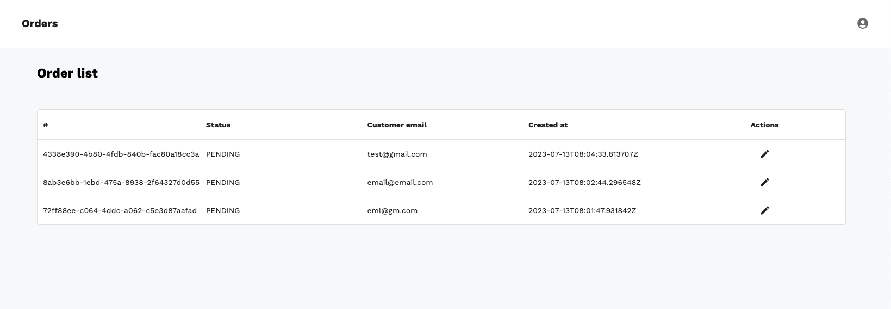

The actions column contains the following buttons:
* Edit

## Edit
Click on the edit button opens the order details page.

## Order details
This page shows full information about the order. The page is divided into the following sections:
* Order items
* Status
* Shipping Info
* Billing info
* Shipping and payment methods

### Order items
This section shows a list of all items in the order. The list has the following columns:
* Product variant name - click on the name opens the product variant details page (described in TODO: add link)
* SKU
* Quantity
* Unit price (without VAT)
* Actions
  * Edit - admin can change the quantity of the product variant
  * Delete - admin can delete the product variant from the order
  
This section also shows the total price (without VAT) of a given order.

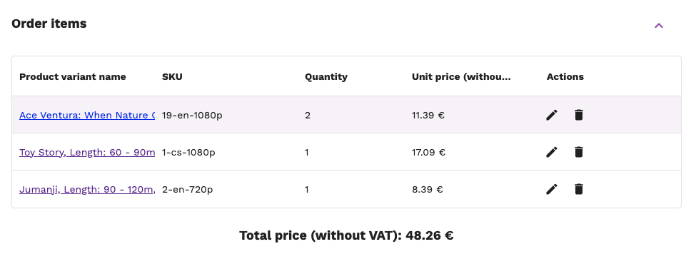

### Status
This section shows the current status of the order. The status can be changed by the admin using a drop-down menu.

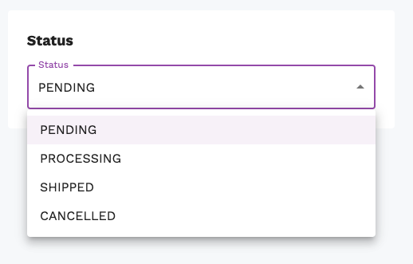

### Shipping and billing info
This section shows the shipping and billing information of the order. It contains the same information as the shipping and billing information in the checkout process. Information is shown in the form view, and the admin is again able to modify its content.

|                     Shipping info                      |                     Billing info                     |
| :----------------------------------------------------: | :--------------------------------------------------: |
|  | 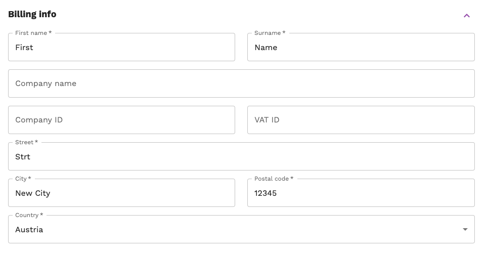 |

### Shipping and payment method
This section shows selected shipping and payment methods along with their prices.

TODO: add image

### Order item complaints

TODO: describe

# Reviews
The reviews page consists of a list showing all reviews. The list has the following columns:
* Review token
* Product variant
* Product ID
* Rating
* Comment
* Created at
* Actions
  * Detail - click on the detail button opens the review details page (see [below](#review-details))
  * Delete - click on the delete button deletes the review

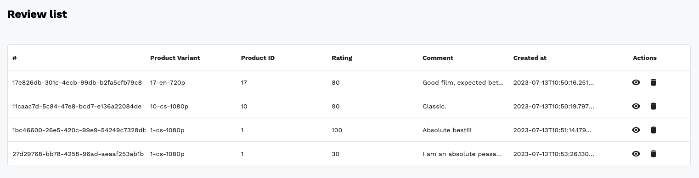

## Review details
This page shows full information about the review and overall rating of the product. The page is divided into the following sections:
* Rating - shown via stars and percentage
* Product ID
* Comment
* Average product rating

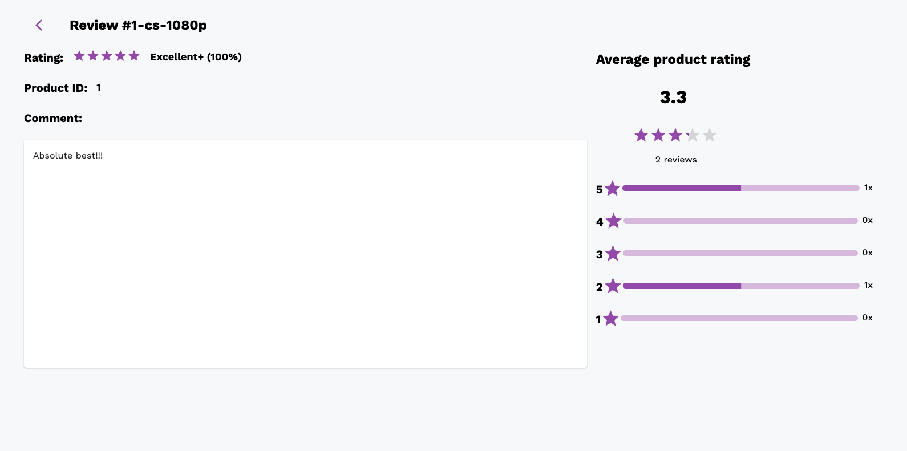
### Average product rating
This section shows the average rating of the product. The rating is shown via start and average score (value from 0 to 5). It also shows the number of reviews for the product and the distribution of ratings. Distribution values are rounded up - this means that if the user submitted a rating of 4.5, it will be shown as 5 in the distribution.

# Catalog
# Localization
# CMS
This section describes creating and editing pages and menus (of pages). We have two types of pages:
* CMS Page
* * CMS Page is a page that is created and edited by the admin in the dashboard. It can contain any content that the admin wants to show to the user. The admin can create as many CMS pages as he wants.

# Users & Roles
This page provides an overview of all users and roles. It is into two main parts:
* Users
* Roles

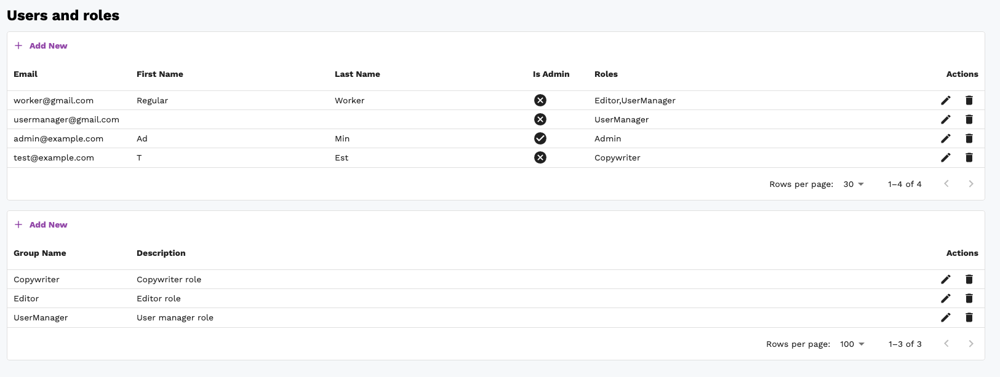
## Users
This section shows a list of all users. The list has the following columns:
* Email
* First name
* Last name
* Is Admin
* Roles
* Actions
  * Edit - click on the edit button opens the user details page (see [below](#user-details))
  * Delete - click on the delete button deletes the user

### User details
The user details page shows full information about the user. The page is divided into three main parts:
* General information:
  * Email (cannot be changed)
  * First Name
  * Last Name
  * Is Admin - only admin can change this value
  * Is Staff
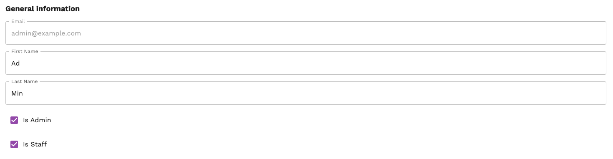
* Password
  * Old password - displayed only if a user is editing his profile
  * New password
  * New password confirmation
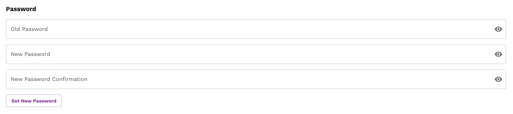
* Roles - a checklist of all roles available in the system. If a user has a role assigned, the checkbox is checked.

### Create user
To create a new user, click on the *Add New* button in the users list. This opens a new page where the user can set the email and password.
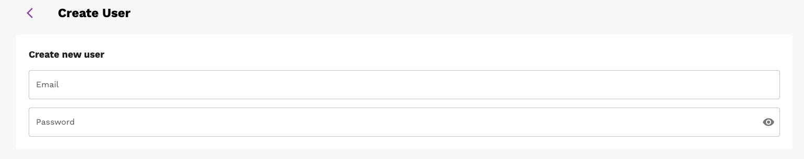

## Roles
Roles are used to group various permissions into one unit. This plays a crucial role in the authorization process as it restricts access to certain parts of the system. Only the admin or users with the `user_change_permission` permission can edit the user (for more detailed info about permissions see [Authorization page](../../administration/authorization)). The system comes with three predefined roles:
* Editor
* Copywriter
* UserManager

Admin counts as a special role that has all permissions. Authorized users can create new roles or edit existing ones.
### Create role
To create a new role, click on the *Add New* button in the roles list. This opens a new page where the user can enter the name of the role, its description and select permissions that will be assigned to the role.
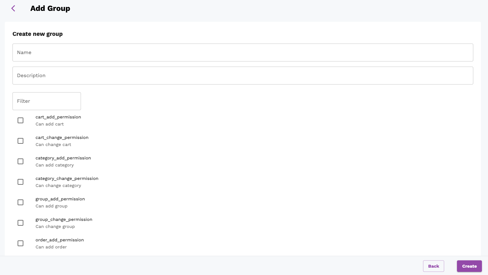

### Edit role
To edit an existing role, click on the edit button in the roles list. This opens a new page where the user can edit a description of a given role and select permissions that will be assigned to the role.

# Recommender system