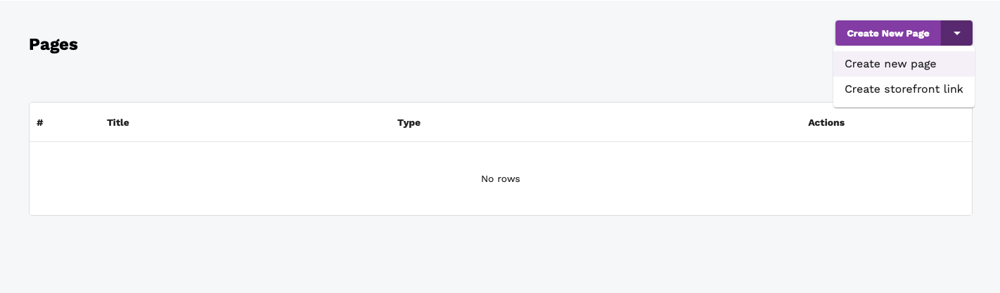
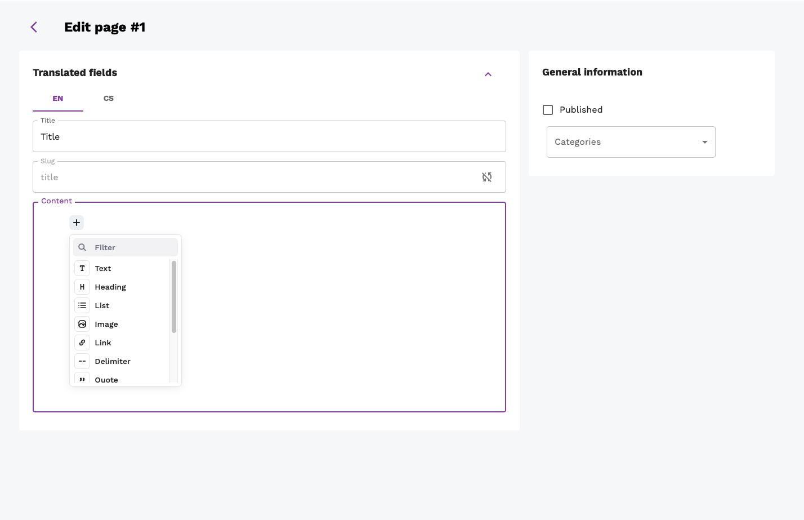
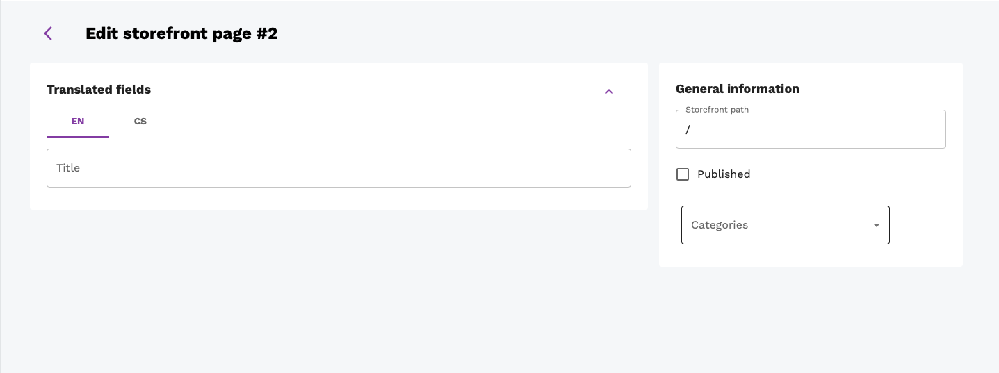
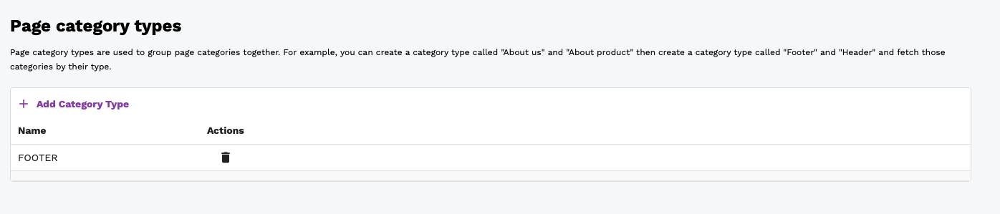
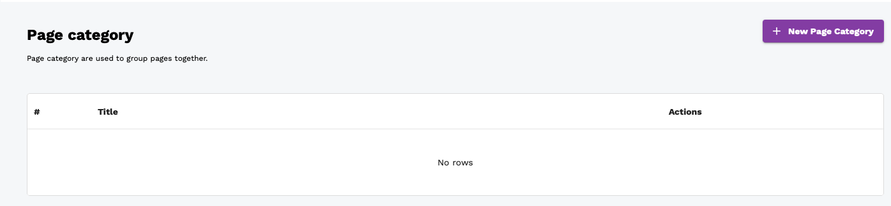
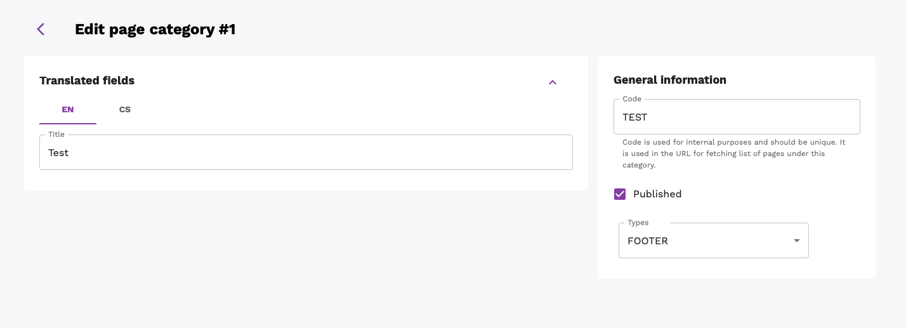

Table of contents:
* TOC
{:toc}

# Overview
The Overview page provides summarised information about the store. It is the first page that is shown to the user after logging in. The page is divided into two main sections:
* Today's statistics
* Statistics for the last 30 days

## Today's statistics
For today's statistics, the following information is shown:
* Orders count
* Revenue
* Average order value
* Average items per order
* Top selling product

## Statistics for the last 30 days
For the last 30 days' statistics, the following information is shown:
* Orders count
* Revenue
* Average order value
* Average items per order
* Up to 5 top selling products
* Line graph showing orders count for the last 30 days

# Cart
# Orders
The orders page consists of a list showing all orders. The list has the following columns:
* Order token
* Status
* Customer email
* Created at
* Actions

The actions column contains the following buttons:
* Edit

## Edit
Click on the edit button opens the order details page.

## Order details
This page shows full information about the order. The page is divided into the following sections:
* Order items
* Status
* Shipping Info
* Billing info
* Shipping and payment methods

### Order items
This section shows a list of all items in the order. The list has the following columns:
* Product variant name - click on the name opens the product variant details page (described in TODO: add link)
* SKU
* Quantity
* Unit price (without VAT)
* Actions
  * Edit - admin can change the quantity of the product variant
  * Delete - admin can delete the product variant from the order
  
This section also shows the total price (without VAT) of a given order.

### Status
This section shows the current status of the order. The status can be changed by the admin using a drop-down menu.

### Shipping and billing info
This section shows the shipping and billing information of the order. It contains the same information as the shipping and billing information in the checkout process. Information is shown in the form view, and the admin is again able to modify its content.

|                     Shipping info                      |                     Billing info                     |
| :----------------------------------------------------: | :--------------------------------------------------: |
|  |  |

### Shipping and payment method
This section shows selected shipping and payment methods along with their prices.

TODO: add image

### Order item complaints

TODO: describe

# Reviews
The reviews page consists of a list showing all reviews. The list has the following columns:
* Review token
* Product variant
* Product ID
* Rating
* Comment
* Created at
* Actions
  * Detail - click on the detail button opens the review details page (see [below](#review-details))
  * Delete - click on the delete button deletes the review

## Review details
This page shows full information about the review and overall rating of the product. The page is divided into the following sections:
* Rating - shown via stars and percentage
* Product ID
* Comment
* Average product rating

### Average product rating
This section shows the average rating of the product. The rating is shown via start and average score (value from 0 to 5). It also shows the number of reviews for the product and the distribution of ratings. Distribution values are rounded up - this means that if the user submitted a rating of 4.5, it will be shown as 5 in the distribution.

# Catalog
# Localization
# CMS
This section describes creating and editing pages and menus (of pages). We have two types of pages:
* CMS Page
* * CMS Page is a page that is created and edited by the admin in the dashboard. It can contain any content that the admin wants to show to the user. The admin can create as many CMS pages as he wants.
* Storefront Link
* * Storefront page/link is a special type of a page that lives in the storefront and is created and edited by the storefront programmer. In dashboard you can just create a information about the page and link it to the storefront page. This is useful when you want to create a link to a page that is not a CMS page (e.g. something with more CSS and Java/TypeScript).

Both pages can be categorized into "menus" - this means that you can create a menu and add pages to it. The menu can then be fetched from storefront.

## Pages
The pages page consists of a list showing all pages. The list has the following columns:
* ID
* Title
* Type - CMS or Storefront
* Actions

### Creating new CMS page
To create a new CMS page, click on the arrow next to *Create New Page* button in the upper right corner. This opens a drop-down menu with two options:
* Page
* Storefront link
Select the *Page* option to create a new CMS page and click the button.

### Editing CMS page
Simply click on the edit icon of page that you want to edit in the list. This opens a page with the following fields:
* Title
* Slug - this is the URL of the page. It is automatically generated from the title, but you can change it if you want. Just click on the *sync* button in the to the slug field. Just make sure that the slug is unique.
* Content - this is the content of the page. Use *editorjs* to create the content. You can find more information about *editorjs* [here](https://editorjs.io/).
* Published - this is a checkbox that indicates whether the page is published or not. If the page is not published, it will not be shown in the storefront and will not be accessible via the URL - 404 error will be shown instead.
* Categories - this is a list of categories that the page belongs to.

### Creating new storefront link
To create a new storefront link, click on the arrow next to *Create New Page* button in the upper right corner. This opens a drop-down menu with two options:
* Page
* Storefront link
Select the *Storefront link* option to create a new storefront link and click the button.

### Editing storefront link
Simply click on the edit icon of page that you want to edit in the list. This opens a page with the following fields:
* Title - this is the title of the page. It is shown in the storefront.
* Storefront path - this is the path to the storefront page.
* Published - this is a checkbox that indicates whether the page is published or not. If the page is not published, it will not be shown in the storefront and will not be accessible via the URL - 404 error will be shown instead.
* Categories - this is a list of categories that the page belongs to.

## Categories & Types
This page consists of two parts:
* Categories
* Page category types

**Page category type** basically works as a groupping of **categories**. It is used to group categories that are used for the same purpose. For example, you can create a page category type called *FOOTER* and add categories *About us*, *Contact us*, *Terms and conditions* to it. Then you can use this page category type in the footer of the storefront - since it's automatically fetched from the dashboard.

### Page category type
This section shows a list of all page category types. The list has the following columns:
* Name (unique code)
* Actions (delete)

#### Creating a new category type
In order to create a new page category type, click on the *Add category type* button in the upper left corner of the table. This adds a new row to the table. Fill in the unique name of the page category type and click on the *Save* button.
Since the **Name** field is unique and serves as an identifier of the page category type, it cannot be changed thus editing is not allowed.

### Categories
This section shows a list of all categories. The list has the following columns:
* ID
* Title
* Actions

#### Creating a new category
In order to create new category, click on the *New page category* button in the upper left corner of the table. This redirects you to the detail category page. 
Now follow steps the same as for editing a category (see [below](#editing-a-category)).

#### Editing a category
In order to edit a category, click on the edit icon in the table. This redirects you to the detail category page.

1. Fill in the title of the category
2. Select the page category type from the drop-down menu.
3. Set unique code of the category. This code is used to identify the category in the storefront. It is also used to fetch the category as a group.
4. Set published checkbox. If the category is not published, it will not be shown in the storefront.
Then click on the *Save* button.

# Users & Roles
This page provides an overview of all users and roles. It is into two main parts:
* Users
* Roles

## Users
This section shows a list of all users. The list has the following columns:
* Email
* First name
* Last name
* Is Admin
* Roles
* Actions
  * Edit - click on the edit button opens the user details page (see [below](#user-details))
  * Delete - click on the delete button deletes the user

### User details
The user details page shows full information about the user. The page is divided into three main parts:
* General information:
  * Email (cannot be changed)
  * First Name
  * Last Name
  * Is Admin - only admin can change this value
  * Is Staff

* Password
  * Old password - displayed only if a user is editing his profile
  * New password
  * New password confirmation

* Roles - a checklist of all roles available in the system. If a user has a role assigned, the checkbox is checked.

### Create user
To create a new user, click on the *Add New* button in the users list. This opens a new page where the user can set the email and password.

## Roles
Roles are used to group various permissions into one unit. This plays a crucial role in the authorization process as it restricts access to certain parts of the system. Only the admin or users with the `user_change_permission` permission can edit the user (for more detailed info about permissions see [Authorization page](../../administration/authorization)). The system comes with three predefined roles:
* Editor
* Copywriter
* UserManager

Admin counts as a special role that has all permissions. Authorized users can create new roles or edit existing ones.
### Create role
To create a new role, click on the *Add New* button in the roles list. This opens a new page where the user can enter the name of the role, its description and select permissions that will be assigned to the role.

### Edit role
To edit an existing role, click on the edit button in the roles list. This opens a new page where the user can edit a description of a given role and select permissions that will be assigned to the role.

# Recommender system