Table of contents:
* TOC
{:toc}

# Login page

When you first open dashboard, the login page is displayed.

After you login, you're redirected to *Overview* page

# Overview
The Overview page provides summarized information about the store. It is the first page that is shown to the user after logging in. The page is divided into two main sections:
* Today's statistics
* Statistics for the last 30 days

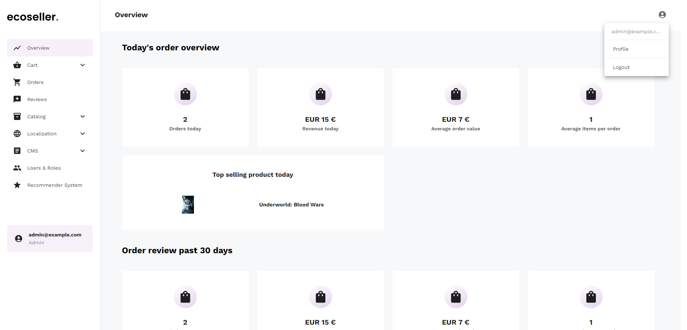

Using the icon on the top right, you can display your profile or logout.

**There's a sidebar menu on the left, which is used for navigation and it's shown on all dashboard pages.**  
The chapters of documentation correspond to these menu items.

## Today's statistics
For today's statistics, the following information is shown:
* Orders count
* Revenue
* Average order value
* Average items per order
* Top selling product

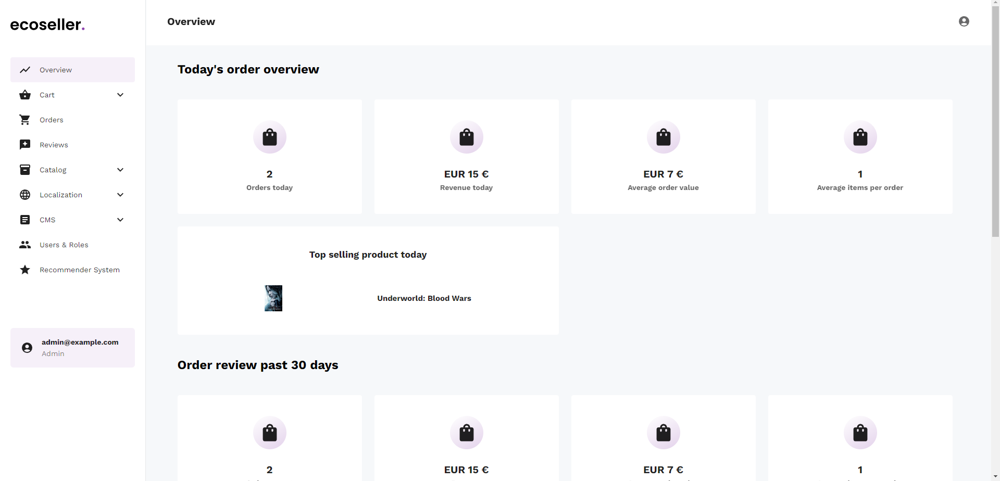

## Statistics for the last 30 days
For the last 30 days' statistics, the following information is shown:
* Orders count
* Revenue
* Average order value
* Average items per order
* Up to 5 top selling products
* Line graph showing orders count for the last 30 days

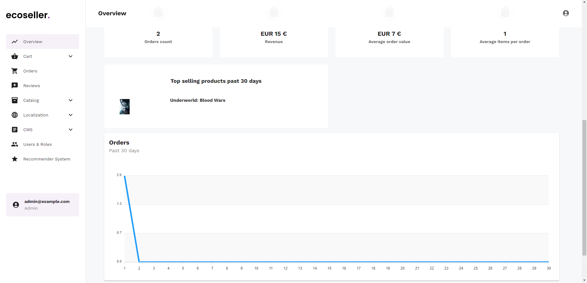

# Cart

Cart section is used to manage shipping and payment methods that can customers use.  
We will describe the both parts in more detail in the following sections.

## Shipping methods

Shipping method page displays list of all shipping methods with the following fields:
- title
- image
- created
- last update

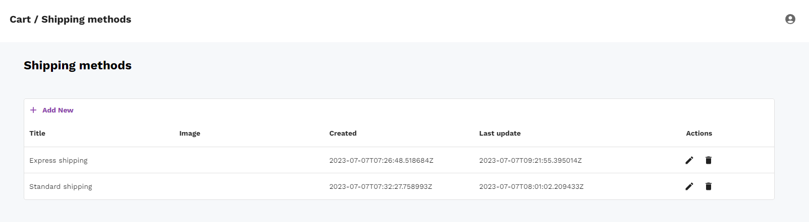

There are also 2 action buttons:
- *Edit* - after you click on this button, you'll be redirected to Shipping metod detail page (see below)
- *Delete* - used for deleting the given shipping method

### Shipping method detail

This page contains detailed info about a shipping method

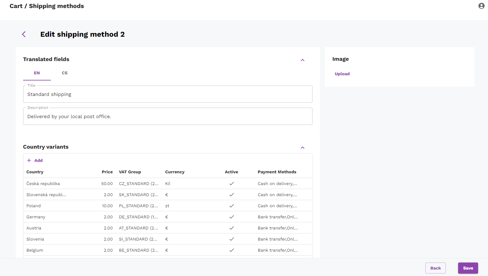

You can edit all of the fields and also add an image (which is shown to customers when they select shipping method). Note that title and description is set individually for each language.  
Below, there's also a table of individual country variants.

This table is editable - you can edit & remove individual rows (using action buttons) as well as add new ones.

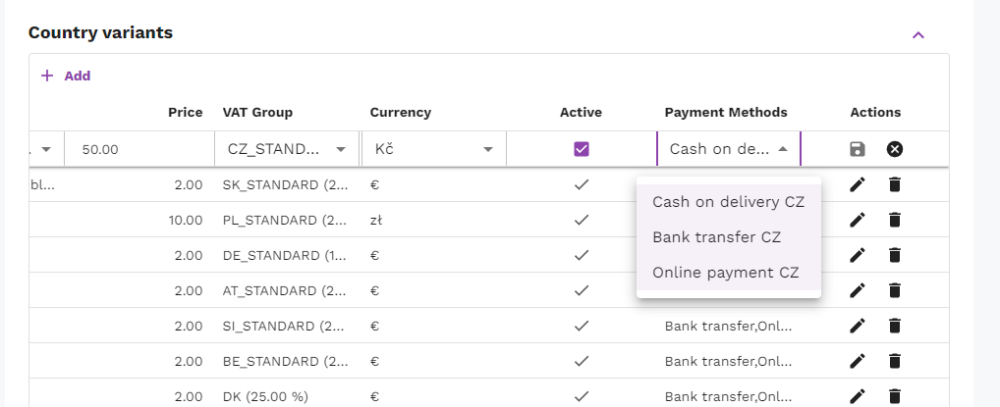

The image above shows that you're able to edit all fields and select available payment methods as well. 
In this case we selected all of the 3 available payment methods.

## Payment methods

Payment method page displays list of all shipping methods with the following fields:
- title
- image
- created
- last update

Note that it looks basically the same as shipping methods page.

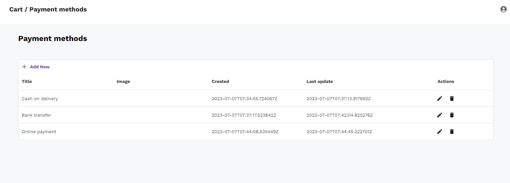

There are also 2 action buttons:
- *Edit* - after you click on this button, you'll be redirected to Payment metod detail page (see below)
- *Delete* - used for deleting the given payment method

### Payment method detail

This page contains detailed info about a payment method.

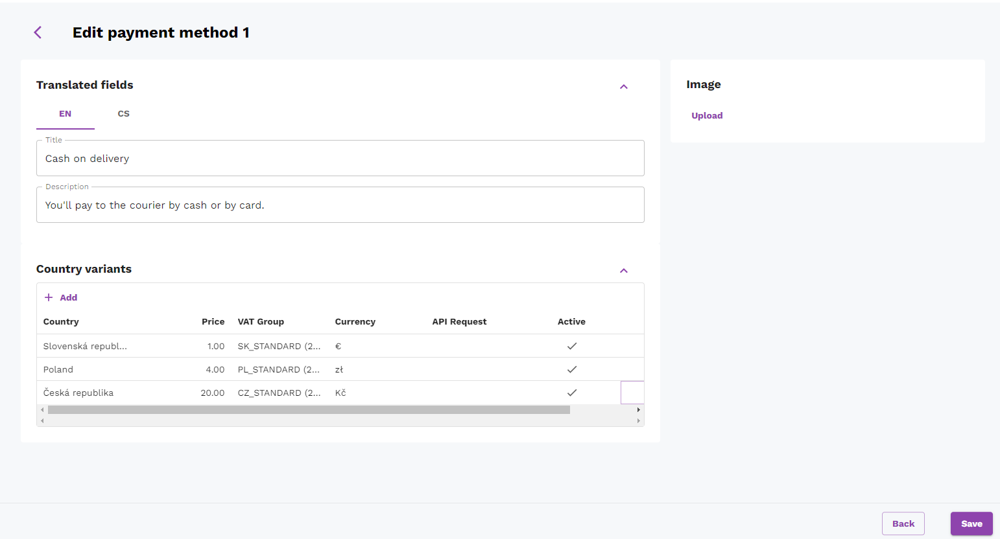

You can edit all of the fields and also add an image (which is shown to customers when they select payment method). Note that title and description is set individually for each language.  
Below, there's also a table of individual country variants.

This table is editable - you can edit & remove individual rows (using action buttons) as well as add new ones.

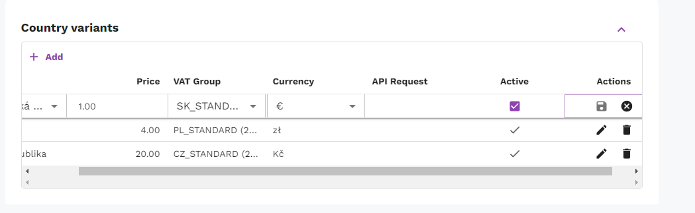

The image above shows that you're able to edit all fields including API request - this way, you're able to select which code should be executed when the customer is about to pay.  
See [Payment Gateway integration process section](../../administration/administration/#payment-gateway-integration-process) for further information.

# Orders
The orders page consists of a list showing all orders. The list has the following columns:
* Order token
* Status
* Customer email
* Created at
* Actions

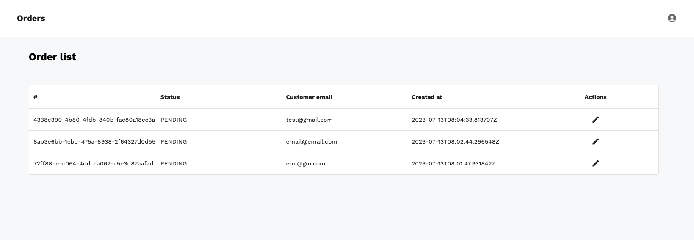

The actions column contains the following buttons:
* Edit

## Edit
Click on the edit button opens the order details page.

## Order details
This page shows full information about the order. The page is divided into the following sections:
* Order items
* Status
* Shipping Info
* Billing info
* Shipping and payment methods

### Order items
This section shows a list of all items in the order. The list has the following columns:
* Product variant name - click on the name opens the product variant details page (described in TODO: add link)
* SKU
* Quantity
* Unit price (without VAT)
* Actions
  * Edit - admin can change the quantity of the product variant
  * Delete - admin can delete the product variant from the order
  
This section also shows the total price (without VAT) of a given order.

### Status
This section shows the current status of the order. The status can be changed by the admin using a drop-down menu.

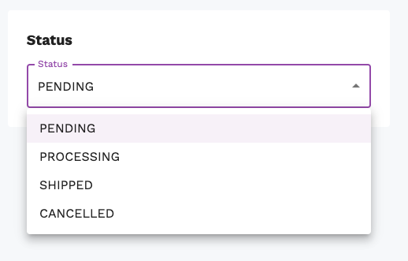

### Shipping and billing info
This section shows the shipping and billing information of the order. It contains the same information as the shipping and billing information in the checkout process. Information is shown in the form view, and the admin is again able to modify its content (if the order's status is set to *PENDING* or *PROCESSING*)

|                          Shipping info                           |                          Billing info                          |
| :--------------------------------------------------------------: | :------------------------------------------------------------: |
| 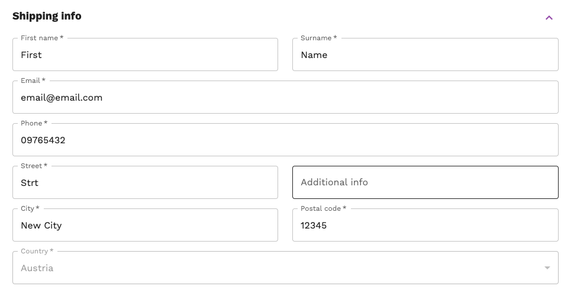 | 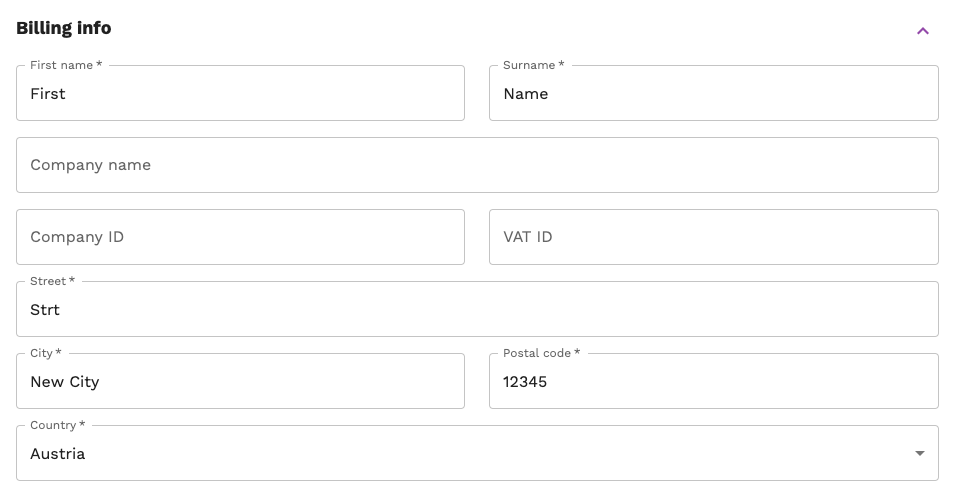 |

### Shipping and payment method
This section shows selected shipping and payment methods along with their prices.

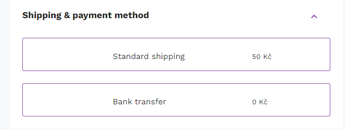

Note that these values cannot be changed.

### Order item complaints

If there are any complaints (warranty claim / return requests) for an order item, you'll see it in `Complaints` column.

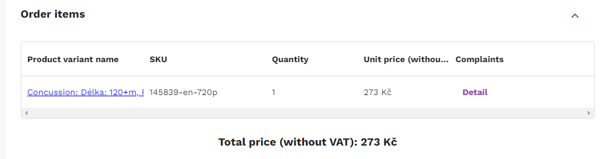

After you click on the complaint detail button, pop-up with complaint details is displayed.

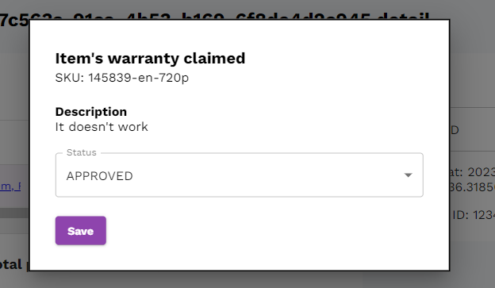

In this pop-up, all complaint details are displayed, and you're able to change its status.

# Reviews
The reviews page consists of a list showing all reviews. The list has the following columns:
* Review token
* Product variant
* Product ID
* Rating
* Comment
* Created at
* Actions
  * Detail - click on the detail button opens the review details page (see [below](#review-details))
  * Delete - click on the delete button deletes the review

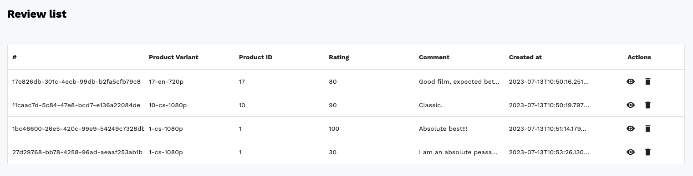

## Review details
This page shows full information about the review and overall rating of the product. The page is divided into the following sections:
* Rating - shown via stars and percentage
* Product ID
* Comment
* Average product rating

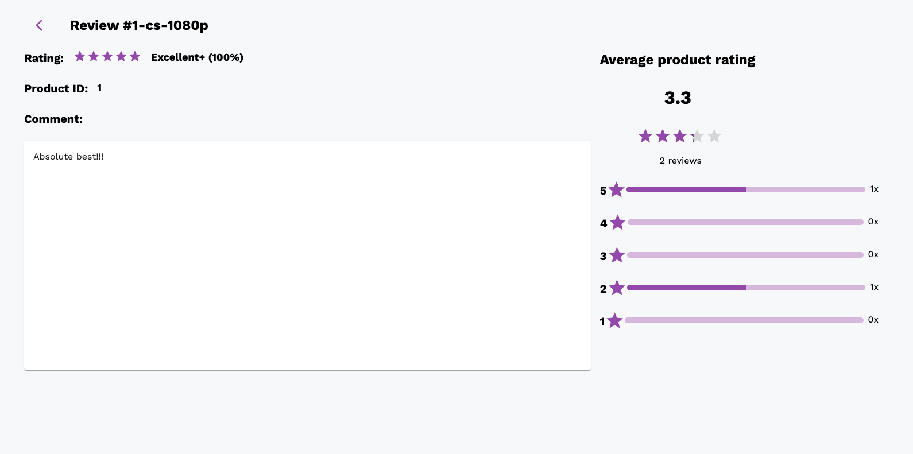
### Average product rating
This section shows the average rating of the product. The rating is shown via start and average score (value from 0 to 5). It also shows the number of reviews for the product and the distribution of ratings. Distribution values are rounded up - this means that if the user submitted a rating of 4.5, it will be shown as 5 in the distribution.

# Catalog
Catalog is the place where you can manage all products and categories. The catalog page consists of:
* Attributes - Attributes binded to the product variants
* Product types - Product types define the structure of the product (what attributes it has)
* Products - Products are the actual products that are shown in the storefront and their variants, prices, etc.
* Categories - Categories are used to group products into categories

## Attributes
Attributes are used to define the structure of the product variant. For example, if you want to sell t-shirts, you need to define attributes like size, color, etc. Attributes are then used in the product type to define the structure of the product variant. Attributes are also used in the product variant to define the actual values of the attributes.

### Attribute list
Under the attributes section, you can see a list of all attributes. The list has the following columns:
* Name - unique name of the attribute, it's not shown in the storefront and is used only in the administration
* Unit - unit of the attribute, for example, cm, kg, etc. It's shown in the storefront next to the value of the attribute (for example 10 cm)
* N. of attributes - just a number of values under the given attribute
* Actions - edit button
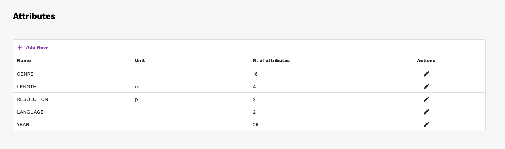

### Creating new attribute
To create a new attribute, click on the button in the upper left corner of the attribute table - *Add New*. You will be redirected to the attribute details page (see [below](#editing-attributes)).

### Editing attribute
To edit an attribute, click on the edit button in the attribute list. This opens the attribute details page.
The detail page consists of the following sections:
1. *General information* - this section contains the name and unit of the attribute. If you've just created the attribute or it has no values, you can change type of attribute (see [below](#attribute-types))
2. *Translated fields* - this section contains the translated name of the attribute. You can translate the name of the attribute into multiple languages.
3. *Attributes* - this section contains the list of values of the attribute. The list has the following columns:
  * Value - the value of the attribute
  * List of languages (if it's `text` attribute type) - the value of the attribute in the given language
  * Actions - edit and delete buttons
    * Edit - click on the edit button opens the edit attribute value page (see [below](#editing-attribute-values))
    * Delete - click on the delete button deletes the attribute value
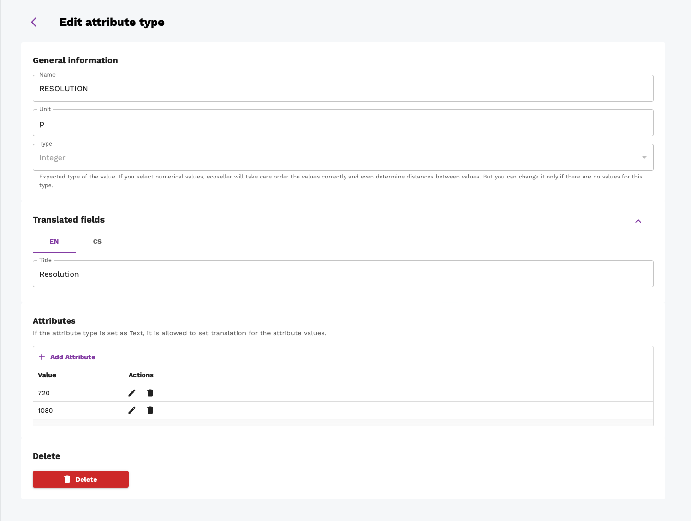

#### Attribute types
There are three expected type of the value. If you select numerical values, ecoseller recommender system will take care order the values correctly and even determine distances between values. But you can change it only if there are no values for this type.
The types are:
* Text
* Integer
* Decimal

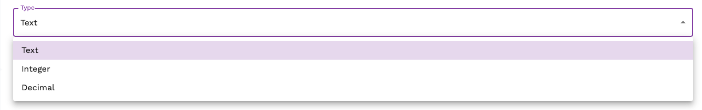

## Product Types
Product types define the structure of the product. For example, if you want to sell t-shirts, you need to define attributes like size, color, etc. Product types are then used in the product to define the structure of the product variant. Product types are also used in the product variant to define the actual values of the attributes.

### Product type list
Under the product types section, you can see a list of all product types. The list has the following columns:
* Name - unique name of the product type, it's not shown in the storefront and is used only in the administration
* Created - date when the product type was created
* Last updated - date when the product type was last updated
* Actions - edit button

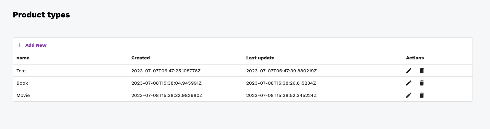

### Creating new product type
To create a new product type, click on the button in the upper left corner of the product type table - *Add New*. You will be redirected to the product type details page (see [below](#editing-product-type)).

### Editing product type
To edit a product type, click on the edit button in the product type list. This opens the product type details page. 
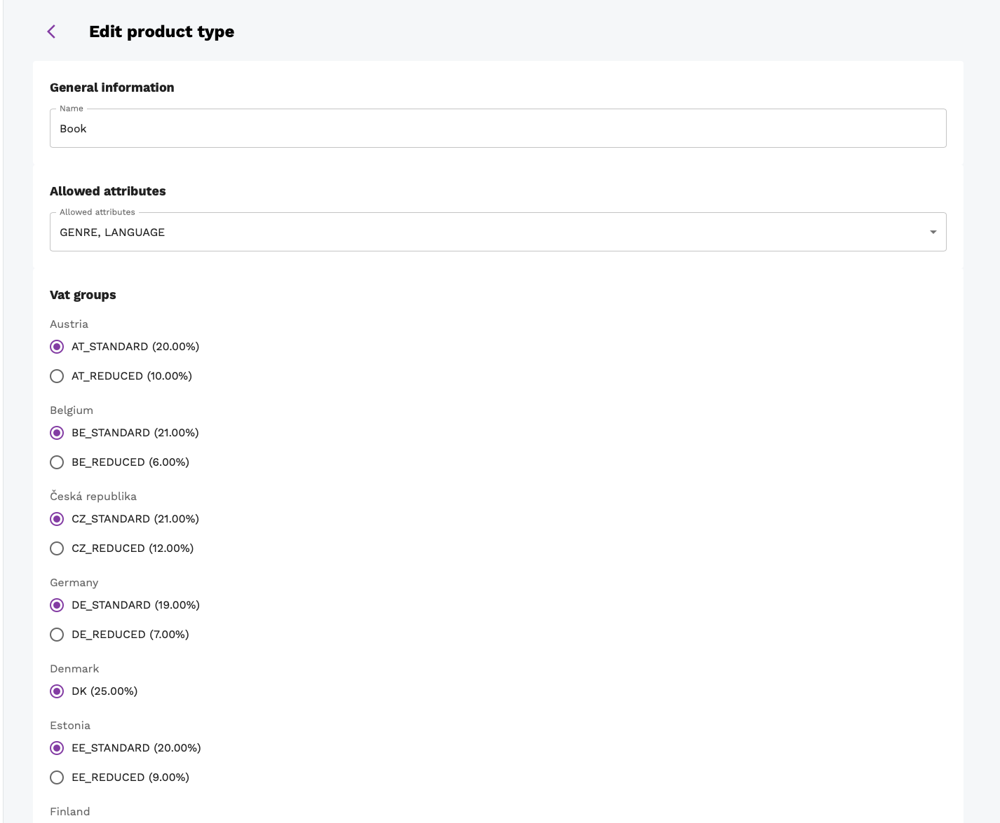

The detail page consists of the following sections:
1. *General information* - this section contains the name of the product type. You'll see this name in the Product edit page (see [below](#editing-product)) when you select the product type. It's not visible in the storefront.
2. *Allowed attributes* - this section contains the list of attributes that are allowed in the product type. It's a dropdown list from which you can select the attributes. You can select multiple attributes. Those are the attribtues that you'll be able to select in the product edit page (see [below](#editing-product)) when you select the product type. 
    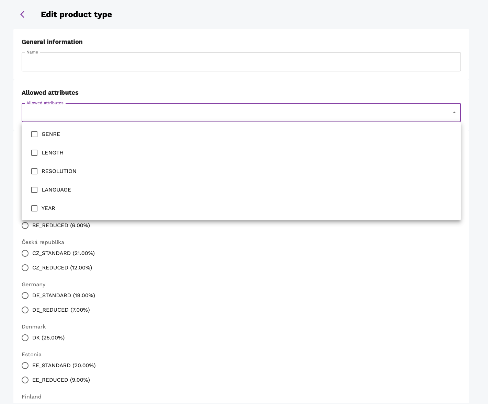
3. *Vat groups* - this section contains the list of vat groups that are allowed in the product type. They're listed in a sections groupped by the country. You need to select *Vat group* for each country. You can select only one vat group per country. When calculating price incl VAT for each product x country, selected vat group will be used.
    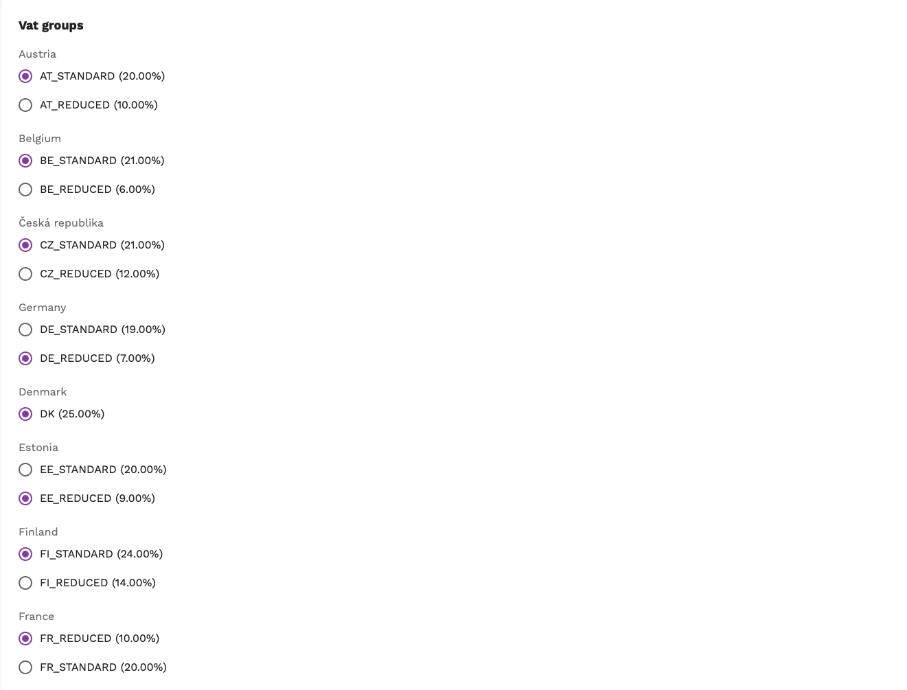
## Products
Products are the core of the catalog. They're the actual products that are shown in the storefront and their variants, prices, etc.

### Product list 
Under the products section, you can see a list of all products. The list has the following columns:
* ID - unique ID of the product
* Title - title of the product
* Photo - primary image of the product
* Published - whether the product is published or not
* Updated at
* Actions - edit button

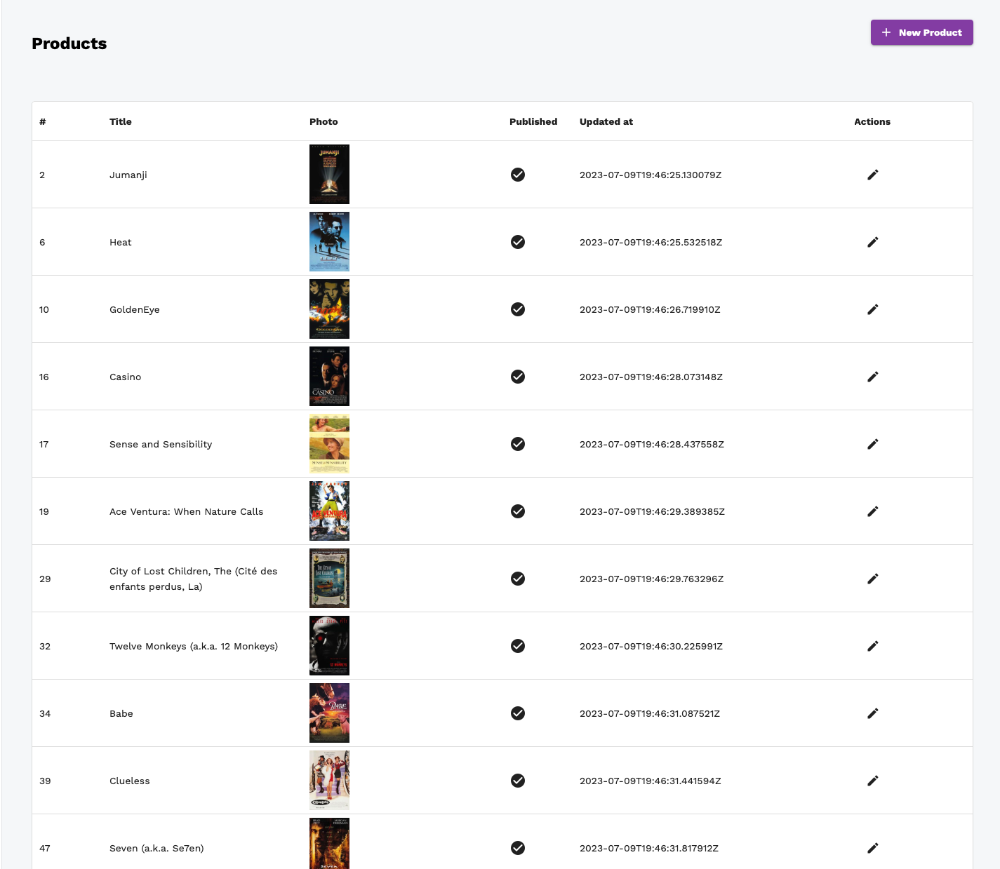

### Creating new product
If you want to create a new product, click on the button in the upper right corner above the product table - *New product*. You will be redirected to the product details page (see [below](#editing-product)).
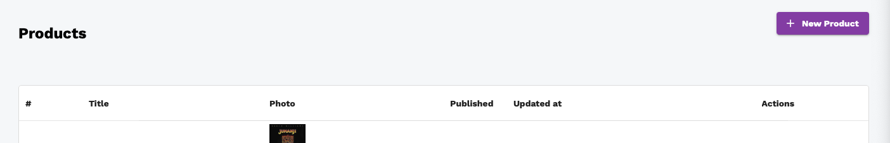
At this point, you can start setting data fields of the product. Make sure you select the product type first. The product type defines the structure of the product variant and it cannot be changed after the product is created.
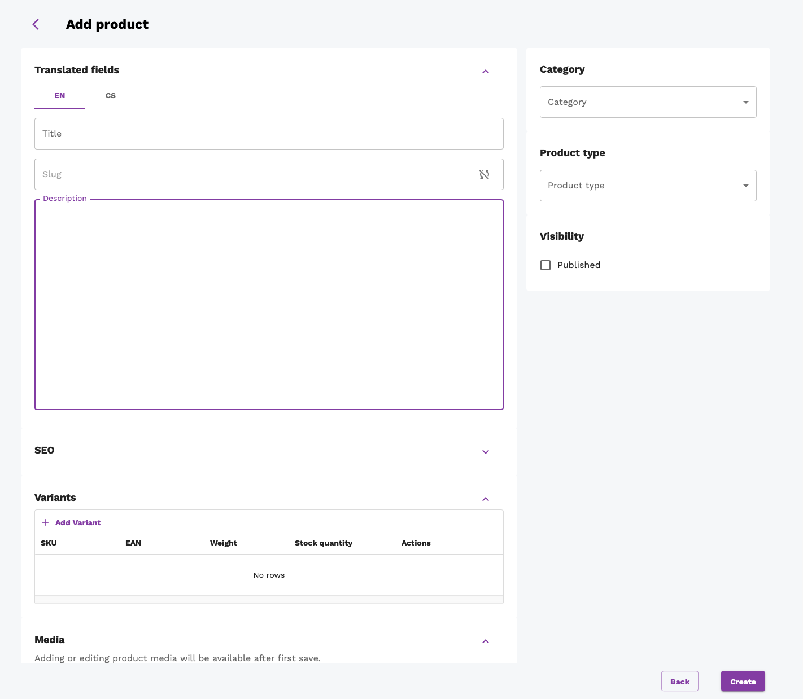
After you firstly save the product, you'll be redirected to the product edit page (see [below](#editing-product)). 

### Editing product
Editing a product is quite large topic. It's because the product is the core of the catalog and it has many different fields. The product edit page is divided into multiple sections. Each section is described in the following subsections.

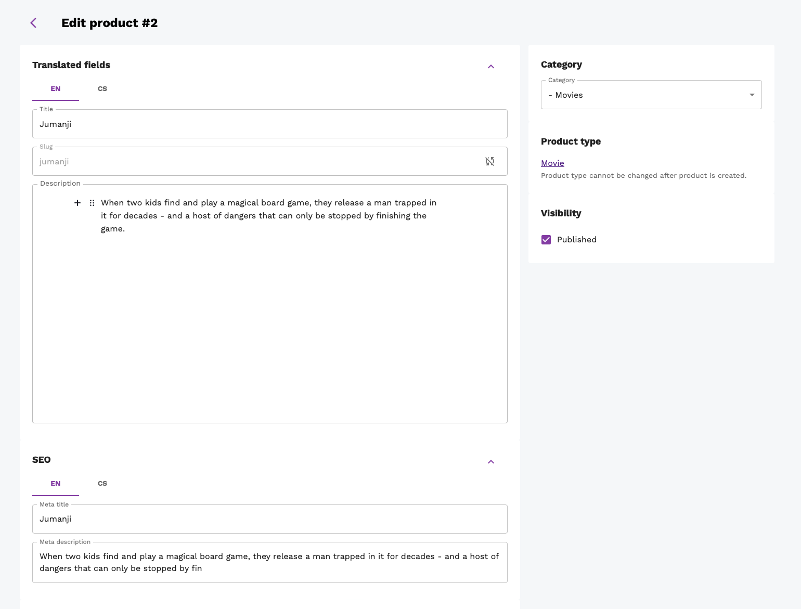

#### Translated fields
This section contains the translated fields of the product. You can translate:
* Title - title of the product
* Slug - slug of the product
  * Slug is a part of the URL of the product. It's the part that comes after the domain name. For example, if the domain name is `www.example.com` and the slug is `my-product`, the URL of the product will be `www.example.com/product/{id}/my-product`.
  * It must be unique across all products
  * Slug is automatically generated from the title of the product. If you change the title, the slug will be automatically updated. If you don't want to use the automatically generated slug, you can change it manually by clicking on the sync button in the slug field. 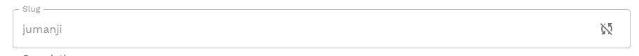
* Description - description of the productin [editorjs](https://editorjs.io/) editor.

of the product into your defined languages.
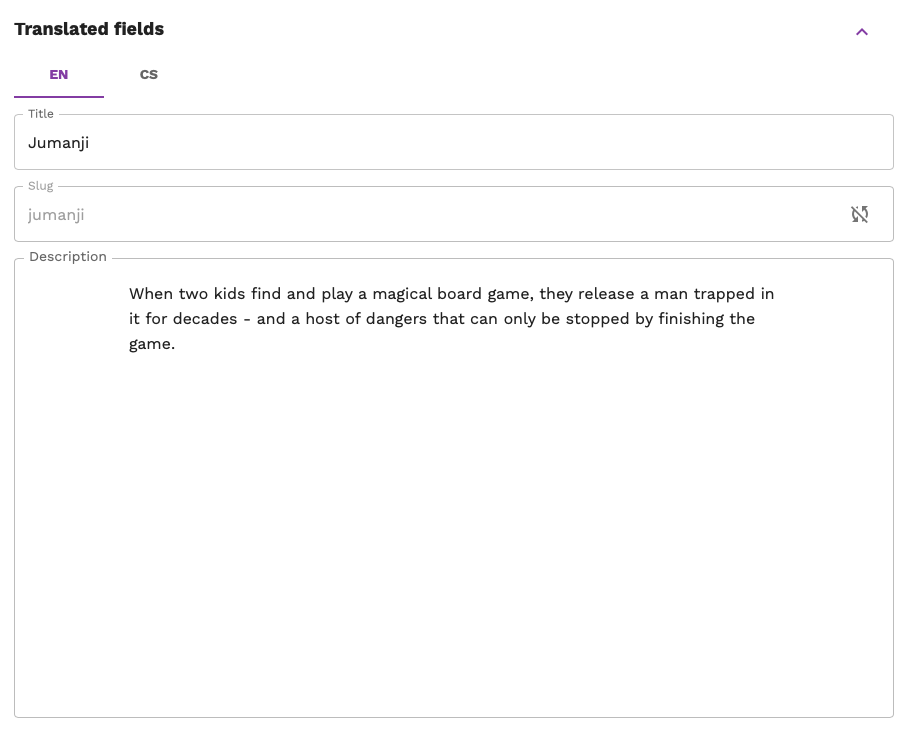

#### SEO

This section contains SEO fields of the product. You can set:
* Meta title - title of the product that is shown in the browser tab or in the search engine results
* Meta description - description of the product that is shown in the search engine results.

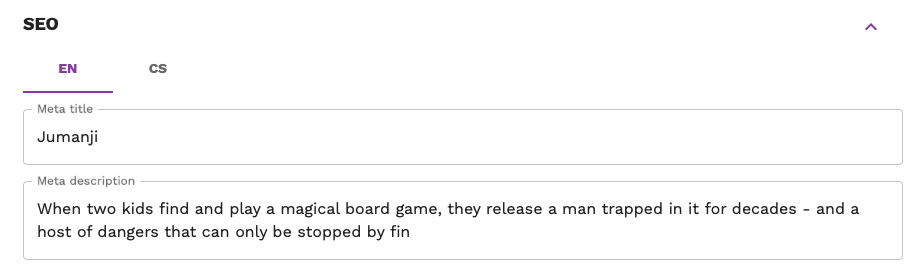

#### Category
This section contains the category of the product. You can select only one category for each product. 

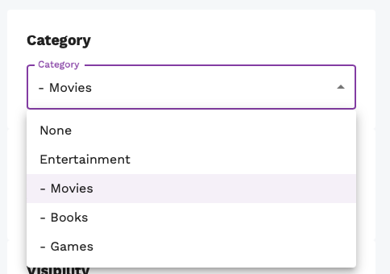

#### Product type
Product type cannot be changed after the product is created. Please see [Product types](#product-types) and [Q: Why can't I change product type after I've created the product](#changing-product-type) for more information.
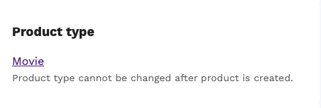

#### Visibility
This section contains the visibility of the product. You can set:
* Published - whether the product is published or not. If the product is not published, it won't be shown in the storefront.

#### Product variants
This section contains the product variants of the product. You can add multiple product variants to the product. Each product variant has the following fields:
* SKU - unique identifier of the product variant. It's used to identify the product variant in the warehouse. It must be unique across all product variants.
* EAN - EAN code of the product variant. It's used to identify the product variant in the warehouse. It's not required.
* Weight - weight of the product variant in grams. It's not required.
* Stock quantity - stock of the product variant. It's not required.
* Attributes - You will see list of attributes based on your selected product type.
* Actions - edit and delete button
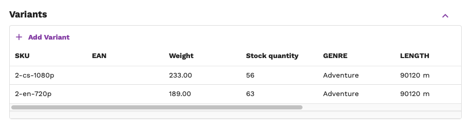

#### Product prices
This section contains the prices of the product. It comes from defined price lists in the Localization section. You can set for each SKU and pricelist:
* Price excl VAT - price of the product variant without VAT. Vat is calculated based on the selected vat group in the product type for given country.
* Discount - discount of the product variant in percentage. It's not required.
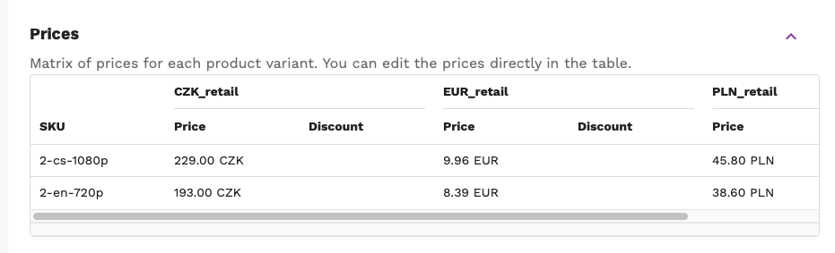

#### Product media
This section contains the media of the product. 
##### Adding images
You can add multiple media (images) to the product using the *Upload* button. 
##### Reordering images (setting primary image)
The primary image (shown in the category) is the first image in the list. You can reorder the images by drag and drop. 
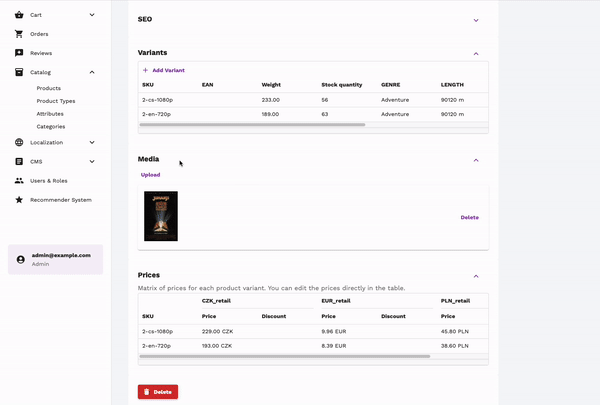

##### Deleting images
You can also delete the images by clicking on the *Delete* icon.
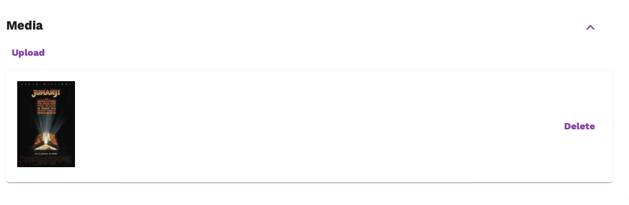

#### General FAQ about products
Here you can find some general questions about editing products and variants.

##### Q: What is the difference between product and product variant?
A: Product is a wrapper around multiple product variants. Imagine that you're selling t-shirts. You have a t-shirt in two sizes (S and M) and two colors (red and blue). This means that you have 4 product variants. But you have only one product. The product is the t-shirt and the product variants are the t-shirt in different sizes and colors.
Product variant is what a actually ship from your warehouse. It's the actual product that the customer buys. In the example above, the product variant is the t-shirt in size S and color red.

##### Q: Why do I need to create product type? 
A: With selected product type at product creation, you can define the structure of the product variant. For example, if you want to sell t-shirts, you need to define attributes like size, color, etc. Product types are then used in the product to define the structure of the product variant. Product types are also used in the product variant to define the actual values of the attributes.
So imagine you have product type `CLOTHING` with attribtues `size` and `color`. If your product is type `CLOTHING`, it's variants need to define values for `size` and `color` attributes.

##### Q: Why can't I change product type after I've created the product? 
A: You can't change product type after you've created the product because the product type defines the structure of the product variant. If you change the product type, you would need to change the structure of the product variant. This would mean that you would need to change the values of the attributes of the product variant.

##### Q: Why do I need to create product variant?
A: Product variant is what a actually ship from your warehouse. It's the actual product that the customer buys.

## Categories
In order to group products into categories, you need to create categories. Categories can be nested - this means that you can create a category and then create a subcategory of that category. You can create as many subcategories as you want. The nesting is not limited. The categories are shown in the storefront in the navigation menu up to the third level of nesting.

### Category list
The category list shows all categories in the store. The list has the following columns:
* ID
* Title - the title of the category with the nesting level shown via indentation
* Published - whether the category is published or not (visible and browsable in the storefront)
* Updated at
* Actions - edit button

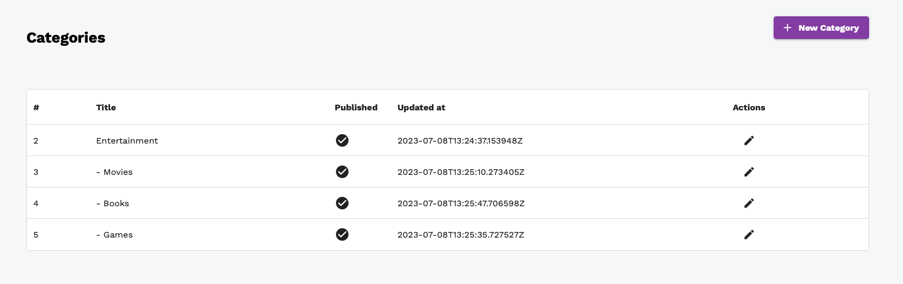

### Creating new category
To create a new category, click on the button in the upper right corner  *New Category*. You will be redirected to the category details page. 
Now you can follow steps described in the [editing category](#editing-category) section.

### Editing category
To edit a category, click on the edit button in the category list. This opens the category details page.

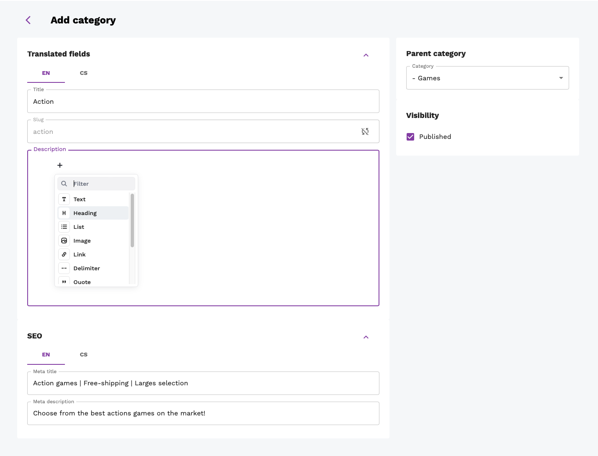
1. In the *Translated fields* section, you can: 
   1. Edit or add title of the category. The title is required and doesn't have to  unique. 
   2. Edit or add slug of the category. Slug is required and has to be unique. The slug is used in the URL of the category page in the storefront and is generated automatically from the title. You can change the slug to anything you want, but it has to be unique. If you change the slug, the URL of the category page in the storefront will change. In order to change the slug, click the button in the right corner of the slug field.
   3. You can also add a description of the category. The description is optional and is in the [*editorjs* format](https://editorjs.io/). The description is shown in the storefront on the category page.
2. In the *SEO*  section, you can:
   1. Edit or add meta title of the category. The meta title is optional and doesn't have to be unique. The meta title is shown in the browser tab and in the search results. Otherwise, title of the category is shown.
   2. Edit or add meta description of the category. The meta description is optional and doesn't have to be unique. The meta description is shown in the search results.
3. In the *Parent category* section, you can:
   1. Select parent category of the category. The parent category is optional. If you select a parent category, the category will be nested under the parent category. The nesting is not limited. The categories are shown in the storefront in the navigation menu up to the third level of nesting. If you don't select parent, the category will be a root category.
4. In the *Visibility* section, you can:
   1. Select whether the category is published or not. If the category is published, it is visible and browsable in the storefront. If the category is not published, it is not visible and not browsable in the storefront.

# Localization
The localization part of the dashboard is used to manage country-specific parts of the system. This includes:
* Countries
* Vat Groups
* Price Lists
* Currency

Each of these parts has its page in the dashboard. We will describe them in more detail in the following sections.

## Countries
This page consists of a list showing all countries. The list has the following columns:
* Code
* Name
* Locale
* Default pricelist
* Actions
  * Edit - click on the edit button unlocks the row for editing
  * Delete - click on the delete button deletes the country

To add a new country, click on the *Add New* button in the upper left corner of the table. This adds a new row to the table. Fill in the code, name, locale and default pricelist of the country and click on the *Save* icon.

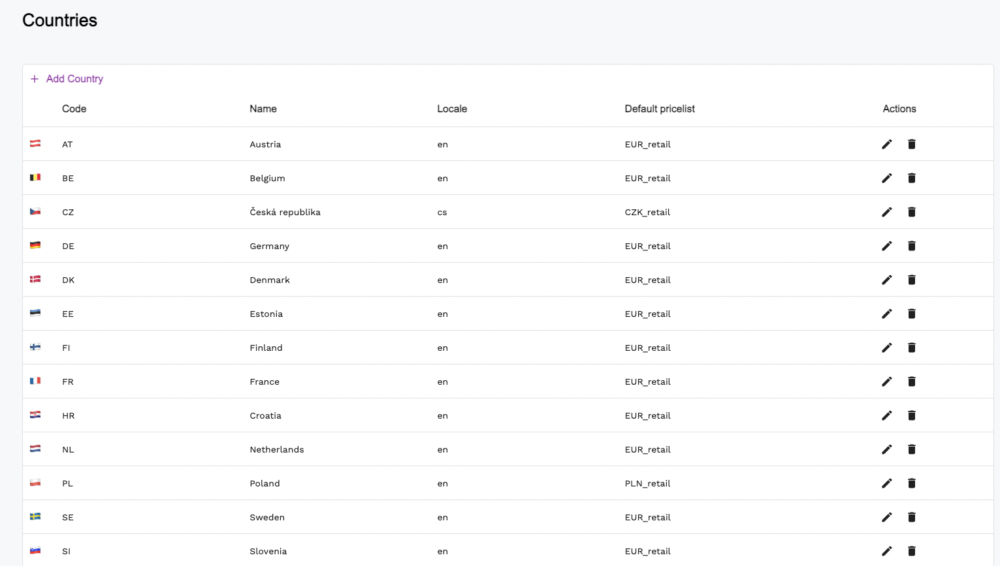

## Vat Groups
This page consists of a list showing all vat groups. The list has the following columns:
* Vat rate (in %)
* Name
* Country
* Default
* Actions
  * Edit - click on the edit button unlocks the row for editing
  * Delete - click on the delete button deletes the vat group

To add a new vat group, click on the *Add New* button in the upper left corner of the table. This adds a new row to the table. Fill in the vat rate, name, and country, set the default option and click on the *Save* icon.

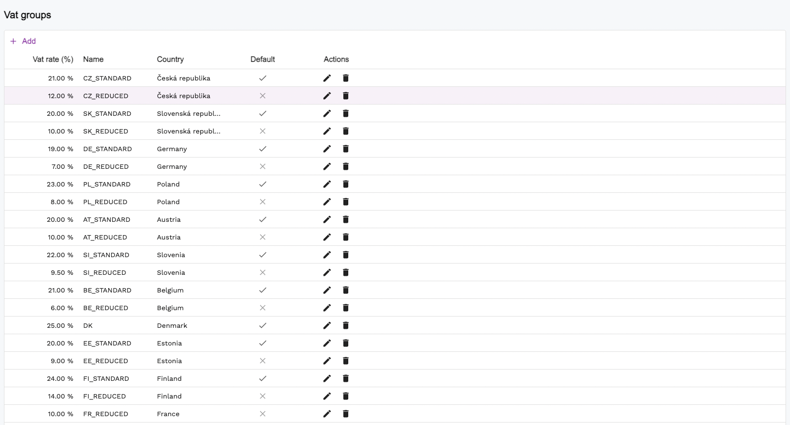

## Price Lists
This page consists of a list showing all price lists. The list has the following columns:
* Code
* Currency
* Rounding
* Is default
* Actions
  * Edit - click on the edit button unlocks the row for editing
  * Delete - click on the delete button deletes the price list

To add a new price list, click on the *Add New* button in the upper left corner of the table. This adds a new row to the table. Fill in the code and currency, set rounding and default option and click on the *Save* icon.

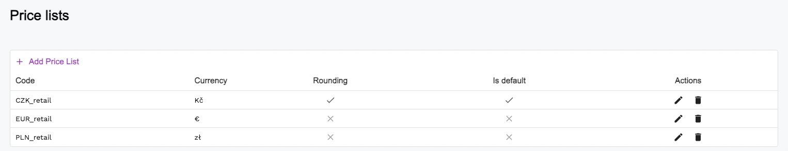

## Currency
This page consists of a list showing all currencies. The list has the following columns:
* Code
* Symbol
* Symbol position
  * Before price
  * After price
* Actions
  * Edit - click on the edit button unlocks the row for editing
  * Delete - click on the delete button deletes the currency

To add a new currency, click on the *Add New* button in the upper left corner of the table. This adds a new row to the table. Fill in the code and symbol, set the symbol position and click on the *Save* icon.

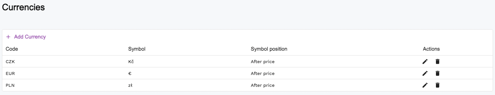

# CMS
This section describes creating and editing pages and menus (of pages). We have two types of pages:
* CMS Page
  * CMS Page is a page that is created and edited by the admin in the dashboard. It can contain any content that the admin wants to show to the user. The admin can create as many CMS pages as he wants.
* Storefront Link
  * A storefront page/link is a special type of page that lives in the storefront and is created and edited by the storefront programmer. In the dashboard, you can just create a piece of information about the page and link it to the storefront page. This is useful when you want to create a link to a page that is not a CMS page (e.g. something with more CSS and Java/TypeScript).

Both pages can be categorized into "menus" - this means that you can create a menu and add pages to it. The menu can then be fetched from the storefront.

## Pages
The pages page consists of a list showing all pages. The list has the following columns:
* ID
* Title
* Type - CMS or Storefront
* Actions

### Creating a new CMS page
To create a new CMS page, click on the arrow next to *Create New Page* button in the upper right corner. This opens a drop-down menu with two options:
* Page
* Storefront link
Select the *Page* option to create a new CMS page and click the button.
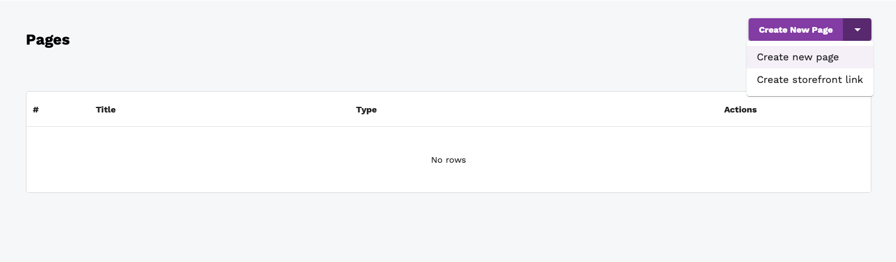

### Editing CMS page
Simply click on the edit icon of the page that you want to edit in the list. This opens a page with the following fields:
* Title
* Slug - this is the URL of the page. It is automatically generated from the title, but you can change it if you want. Just click on the *sync* button in the slug field. Just make sure that the slug is unique.
* Content - this is the content of the page. Use *editorjs* to create the content. You can find more information about *editorjs* [here](https://editorjs.io/).
* Published - this is a checkbox that indicates whether the page is published or not. If the page is not published, it will not be shown in the storefront and will not be accessible via the URL - a 404 error will be shown instead.
* Categories - this is a list of categories that the page belongs to.

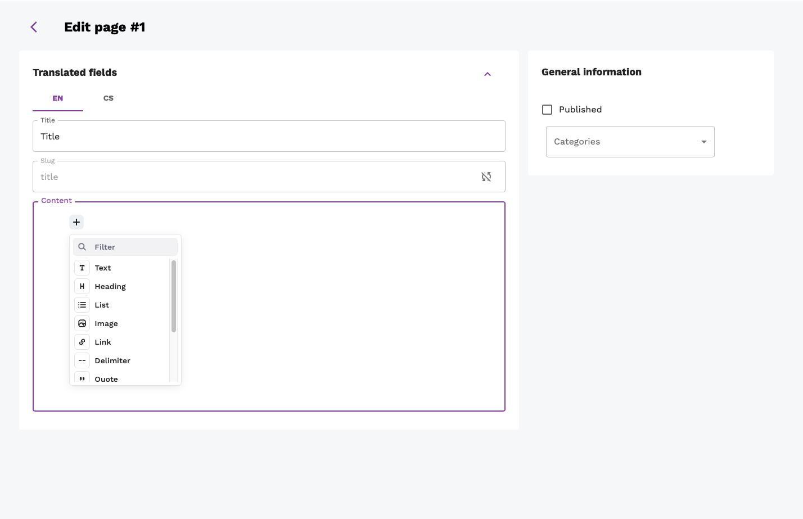

### Creating a new storefront link
To create a new storefront link, click on the arrow next to *Create New Page* button in the upper right corner. This opens a drop-down menu with two options:
* Page
* Storefront link
Select the *Storefront link* option to create a new storefront link and click the button.

### Editing storefront link
Simply click on the edit icon of the page that you want to edit in the list. This opens a page with the following fields:
* Title - this is the title of the page. It is shown on the storefront.
* Storefront path - this is the path to the storefront page.
* Published - this is a checkbox that indicates whether the page is published or not. If the page is not published, it will not be shown in the storefront and will not be accessible via the URL - a 404 error will be shown instead.
* Categories - this is a list of categories that the page belongs to.
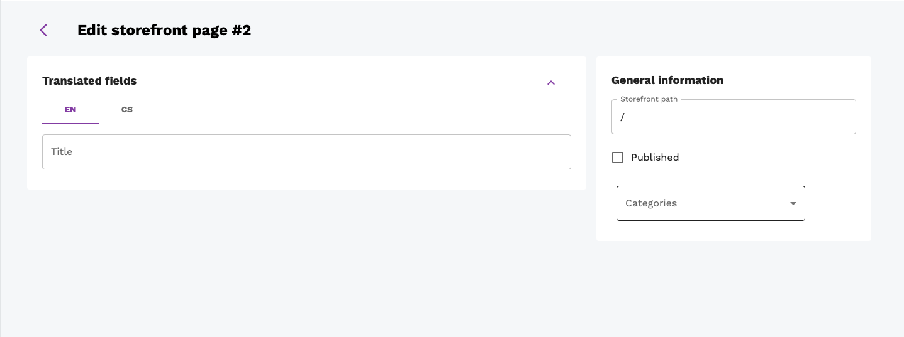

## Categories & Types
This page consists of two parts:
* Categories
* Page category types

**Page category type** works as a grouping of **categories****. It is used to group categories that are used for the same purpose. For example, you can create a page category type called *FOOTER* and add categories *About us*, *Contact us* and *Terms and conditions* to it. Then you can use this page category type in the footer of the storefront - since it's automatically fetched from the dashboard.

### Page category type
This section shows a list of all page category types. The list has the following columns:
* Name (unique code)
* Actions (delete)

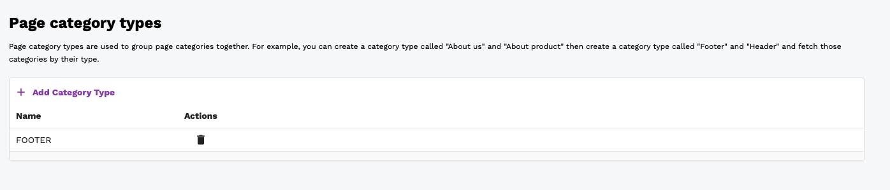

#### Creating a new category type
In order to create a new page category type, click on the *Add category type* button in the upper left corner of the table. This adds a new row to the table. Fill in the unique name of the page category type and click on the *Save* button.
Since the **Name** field is unique and serves as an identifier of the page category type, it cannot be changed thus editing is not allowed.

### Categories
This section shows a list of all categories. The list has the following columns:
* ID
* Title
* Actions

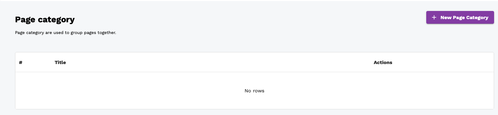
#### Creating a new category
In order to create a new category, click on the *New page category* button in the upper left corner of the table. This redirects you to the detail category page. Now follow the steps the same as for editing a category (see [below](#editing-a-category)).

#### Editing a category
In order to edit a category, click on the edit icon in the table. This redirects you to the detail category page.

1. Fill in the title of the category
2. Select the page category type from the drop-down menu.
Set the unique code of the category. This code is used to identify the category in the storefront. It is also used to fetch the category as a group.
Set the published checkbox. If the category is not published, it will not be shown on the storefront.
Then click on the *Save* button.

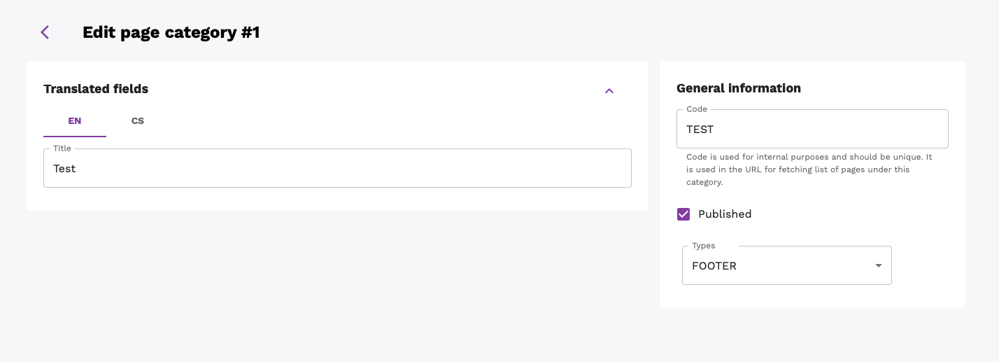

# Users & Roles
This page provides an overview of all users and roles. It is into two main parts:
* Users
* Roles

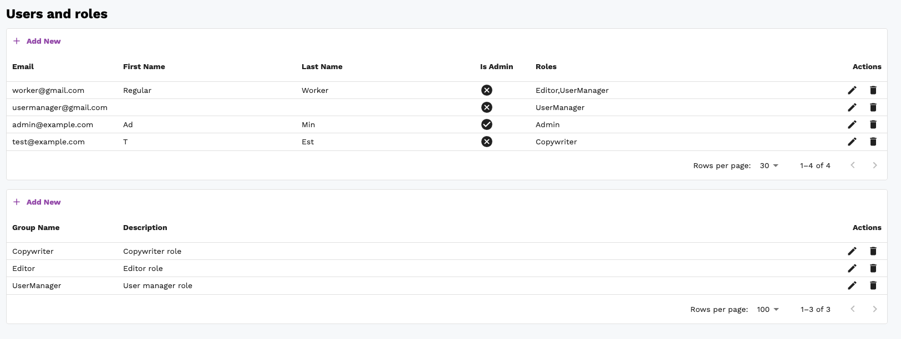
## Users
This section shows a list of all users. The list has the following columns:
* Email
* First name
* Last name
* Is Admin
* Roles
* Actions
  * Edit - click on the edit button opens the user details page (see [below](#user-details))
  * Delete - click on the delete button deletes the user

### User details
The user details page shows full information about the user. The page is divided into three main parts:
* General information:
  * Email (cannot be changed)
  * First Name
  * Last Name
  * Is Admin - only admin can change this value
  * Is Staff
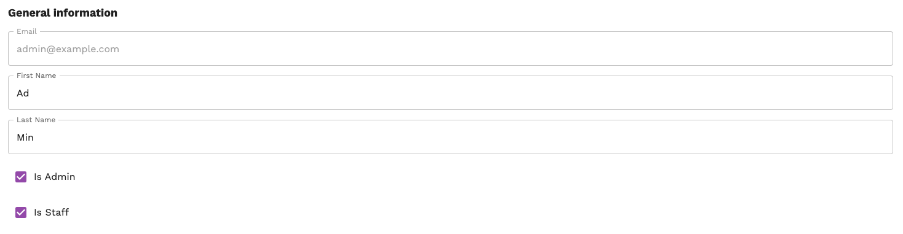
* Password
  * Old password - displayed only if a user is editing his profile
  * New password
  * New password confirmation

* Roles - a checklist of all roles available in the system. If a user has a role assigned, the checkbox is checked.
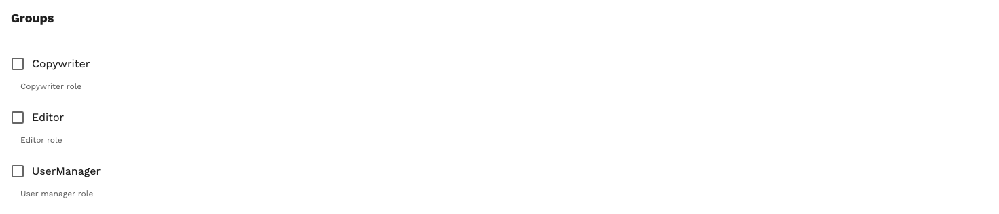

### Create user
To create a new user, click on the *Add New* button in the users list. This opens a new page where the user can set the email and password.

## Roles
Roles are used to group various permissions into one unit. This plays a crucial role in the authorization process as it restricts access to certain parts of the system. Only the admin or users with the `user_change_permission` permission can edit the user (for more detailed info about permissions see [Authorization page](../../administration/authorization)). The system comes with three predefined roles:
* Editor
* Copywriter
* UserManager

Admin counts as a special role that has all permissions. Authorized users can create new roles or edit existing ones.
### Create role
To create a new role, click on the *Add New* button in the roles list. This opens a new page where the user can enter the name of the role, its description and select permissions that will be assigned to the role.
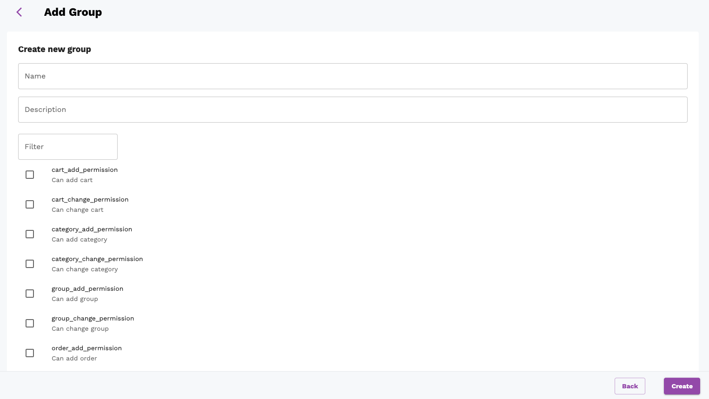

### Edit role
To edit an existing role, click on the edit button in the roles list. This opens a new page where the user can edit a description of a given role and select permissions that will be assigned to the role.
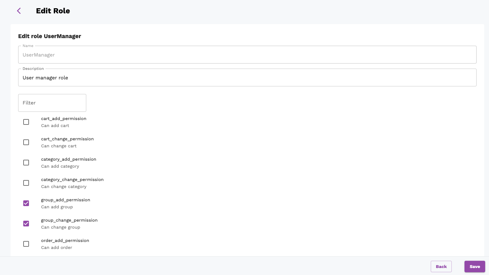

# Recommender system

This page provides an overview of the Recommender system as well as the possibility to configure the Recommender system in real-time.

## Metrics

The Recommender system's performance is monitored the metrics described below.

### Coverage

This metric describes which fraction of the product catalogue did the Recommender system recommend in the last 30 days.

### Direct hit @ $k$

This metric describes how often the users opened one of the top $k$ product details recommended to them as soon as the recommendation occurred.

### Future hit @ $k$

This metric describes how often the users opened one of the top $k$ product details recommended to them if their whole session is considered.
For example a user has been recommended product A's variant in one of the top $k$ recommendations. He then visited products B, C, D and then A.
This counts as hit of recommendation, that provided product A's variant. But it wouldn't count as *Direct hit @ $k$* (if the same recommendation
did not contain product B's variant among the top $k$ variants).

## Global

The performance of the Recommender system as a whole is displayed first. It is also possible to adjust global parameters of the Recommender system.

Global parameters include *retrieval size* and *ordering size*.

*Retrieval size* specifies the number of product variants selected in the *retrieval*
step of the *Prediction pipeline*. These variants are typically selected by less complex model so the more complex model can recommend the best in
reasonable time. Higher number thus means more computational complexity, but better results as the elementary model can filter out relevant product
variants.

*Ordering size* specified the number of product variants that are selected for ordering step of the pipeline. This step reorders the top product variants
to maximize diversity, for example.
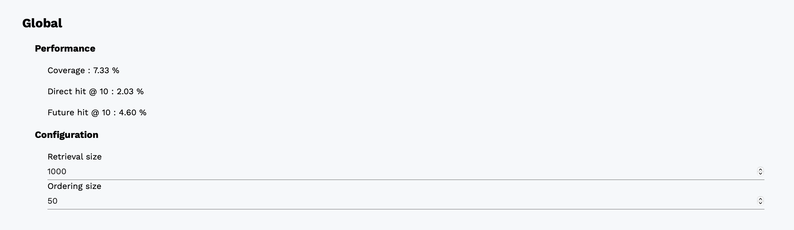

## Models 

The performance of the Recommender system can be inspected by the model providing recommendations and the situation, when the recommendation takes place.
The selected situation contains only the performance of the model selected above.

Latest training statistics are displayed in this section as well as the selected model's configuration.
All configuration options are listed in the [configuration section](../../programming/recommender_system#configuration) of the Recommender system page in the programming documentation.

## Cascades

The last section of this page displays the cascades used by the Recommender system in each situation and pipeline's step.

The Recommender system uses the first model of the cascade that is possible in the current situation - regarding its data and the current user.
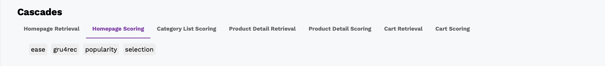
