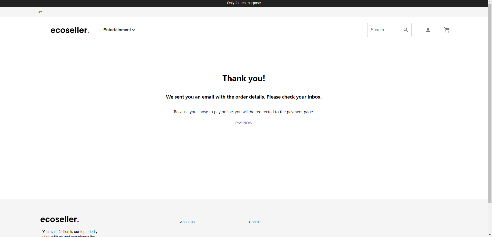

Table of contents:
* TOC
{:toc}

# Homepage

When you first open storefront, the homepage is displayed.

There are several components denoted at the image above

1. Country change button (see below)
2. Category menu - using this menu, you can navigate to individual categories
3. Search bar - used for searching products
4. Profile icon - using this icon, you can login or display your profile info and logout (if already logged-in)
5. Cart icon - after you click on this icon, you're redirected to the cart

The most common use-cases are described below.

## Country change

To change country, firstly click on the country button mentioned above and then select the desired country.

## Best selling products

When you scroll down on homepage, you can see our best selling products.

# Product browsing

After you select category in the top menu, you're redirected to category page

You can filter the products and select their ordering.  
Below, there is a grid of products displayed (using pagination).

Each product card shows its
- photo
- title
- brief description
- price. Note that some products show the price like *From $ 7.31*, which means that there are multiple product variants with different prices and the cheapest of them is displayed.

## Go to product detail

After you click on product card, product detail page is displayed

# Product detail

Product detail page shows product's
- title
- description
- gallery of its photos
- list of its variants including prices.

## Add to cart
In order to add product variant to cart, firstly select its quantity and then click on the *Cart* button next to it.

At the bottom of the page, you can also see recommended products and product reviews.

# Creating an order

After you click on the *Cart* button in the top menu, you're redirected to Cart detail page.

## Cart detail

This page shows all of your cart items including their prices

You can update their quantities or remove them.  
Also note that the *Cart* icon in the top menu contains a badge showing number of items in your cart (cool, right? 😎).  

At the bottom, there's a list of recommended products.

After you select *Next*, you're redirected to shipping & billing info page.

## Shipping & billing information

Here, you need to specify your shipping and billing information.  
If you're logged in and you've saved your billing & shipping info, you can use these saved values. Otherwise, you must fill in the forms.

## Shipping & payment method

In the next step, you select firstly the desired shipping method and then payment method as well.

## Order summary

In the last step, summary of your order is displayed.

To complete the order, you must 
1. Agree with our terms and conditions
2. Click on *Complete order* button

## Order completed page

After you complete the order, the following page is displayed and you recieve a confirmation email.

You can proceed to payment using the link displayed.  
Note that currently, it doesn't work, because no payments are configured. Go to [admin section](../../administration/administration/#implementing-payment-methods-paymentapi) to see a step-by-step guide on how to configure payments.

# Log-in & Registration

You can log-in using the profile icon in the top menu.

If you wish to create a new account, use the *Sign up* link and you'll be redirected to Registration page.

After you've signed up, you can log in using your credentials.

-----

**Note: All of the following actions are available only for logged in users**

-----

# User detail

You can navigate to user detail page using the profile icon.

You can change your password here, as well as set the default billing & shipping information

# Order list

You can navigate to order list page using the profile icon and then selecting *Orders*

List of your orders is displayed

After you click on the Order ID, you'll be redirected to order detail page.

## Order detail page

This page shows detailed info about the given order.

## Warranty claim / return request

For each item, you can create a request for returning or claim its warranty using the *Return*, resp. *Claim warranty* buttons.  
Then, a form is displayed.

After you submit the form, the confirmation page is displayed and an email is sent.

You're notified about any updates using the email as well.
