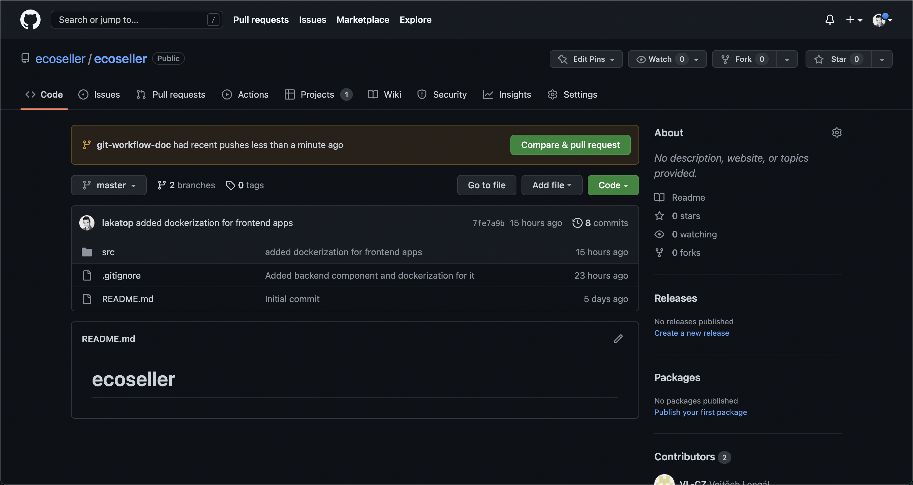
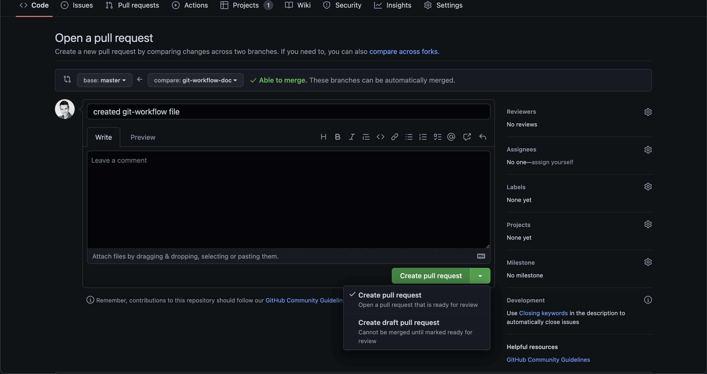
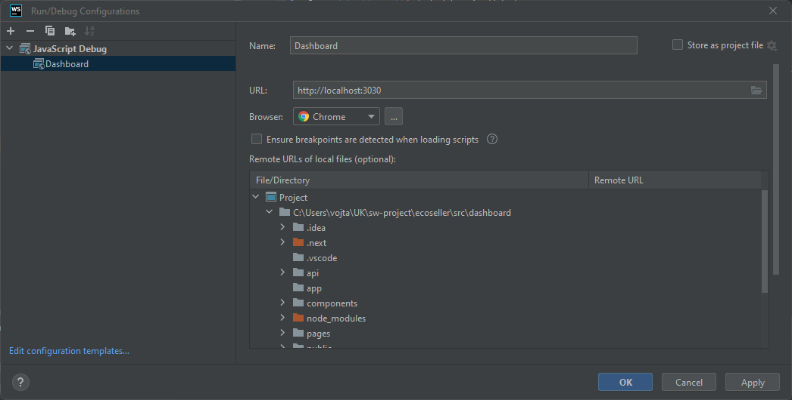

To contribute to ecoseller, please stick to the following rules:

# GIT Workflow

When working on a project, it is important to have a workflow that is easy to understand and follow. This document describes the workflow that we use at [ecoseller](https://ecoseller.io/).

## Working on a new feature/bug

1. Update your master branch - on `master` branch run the following:
    ```
    git pull origin master
    ```

2. Create a new branch and checkout to it
- follow naming convetion for branch names `T-<task-number>`
    ```
    git checkout -b T-<task-number>
    ```
3. Work on a given feature/bug. Commit your work often (you do not need to push these commits to remote branch)
- follow naming convention for commits `[T-<task-numbe>] <short-description>`
    ```
    git add .
    git commit -m "[T-<task-number>] <short-description>"
    ```
4. Push changes to remote branch
    ```
    git push origin T-<task-number>
    ```
- First push to remote branch will create pull request - go to the project github page and click on *Compare & pull request* button

  
- If you are not done with the feature/bug yet, mark this pull request as draft



1. After feature/bug is done, fill in nice description, mark pull request as ready and send it to review
2. When a feature/bug branch is ready to be merged into a `master` branch, do the following:
   1. Update your master branch to the latest state
        ```
        git checkout master
        git pull origin master
        ```
    2. Checkout to feature/bug branch
        ```
        git checkout T-<task-number>
        ```
    3. Rebase feature/bug branch on top of `master` branch and squash commits into one
    - This can be achieved via interactive rebase (`-i` option) which will bring up editor where you can squash all commits to the first one (let `pick` option for the first commit and on all the follwoing commits use `s` option)
    - After squashing, do not forget about naming convention of representative commit `[T-<task-numbe>] <short-description>`
        ```
        git rebase -i master
        ```
    - Fix all potential conflicts while rebasing
    1. Checkout to `master` branch and merge feature/task branch
        ```
        git checkout master
        git merge T-<task-number>
        ```

## Linear history
Applying this workflow keeps the git history of a project **linear**. That is good for the following reasons:
- Easier to read
    - History is more clear
    - No useless commits and new merge commits
- Easier reverting and cherry-picking
- Git bisect

## What to do when
### Forgot to create a new branch
You already made some changes and forgot to switch to new branch. At this point its easy fix, just add what you have done so far and then switch to new branch:
```
git add .
git checkout -b T-<task-number>
```

## Useful commands to remember
- `git log` - shows commits log
  - `--oneline` option
- `git status` - status on current branch
- `git fetch origin` - fetch remote branches
- `git reset HEAD~<number>` - moves `HEAD` pointer `<number>` commits behind
  - `--hard` option - discards local changes
  - `--soft` option - keeps local changes

# Continuous integration

We use [Github actions](https://docs.github.com/en/actions) for CI.  
There are multiple jobs set up (1 for each project component + action for docker compose), which automatically run on every commit to `master` branch
and pull request update.

## What to do if CI jobs fail
See the error in Github Action detail.

If it's a linter/formatter error, see the section of corresponding component.
- [backend](#backend)
- [dashboard](#dashboard)
- [storefront](#storefront)
- [recommender](#recommender)

Follow the instructions for linting / formatting.

After everything works locally, commit and push the changes, CI jobs will start automatically.


### Backend

#### `black`
We're using [black](https://black.readthedocs.io/en/stable/) code formatter.  

Run 
```shell
black ./core
```
to format source files (you need to have virtual env activated).

#### `flake8`
We're using [flake8](https://flake8.pycqa.org/en/latest/) linter.

Run
```shell
flake8 ./core
```
to check for errors and warnings. If there are any errors, you need to fix them manually.


### Dashboard

#### Debugging

##### Webstorm
1. Run dashboard app using `docker compose` or locally
2. Open [dashboard](.) folder in Webstorm
3. Select Run/debug configuration > Add New > Select *JavaScript Debug*
4. Use the URL, where the dashboard is running (see the example below)
    

5. Then, run debuging using *Debug* button in menu.   
(Also note that this way, you'll be able to debug client-side code 
only - therefore not e.g. `getServerSideProps` method)

#### `eslint`
We use [ESLint integrated in Next.js](https://nextjs.org/docs/basic-features/eslint) for linting

Run
```shell
npm run lint
```
to check for warnings.

If there are any warnings, you can fix them automatically (if possible) by running:

```shell
npm run lint -- --fix 
```

#### `prettier`
We use [prettier](https://prettier.io/) code formatter. 

Run

```shell
npm run format
```
to format source code files.


### Storefront

#### `eslint`
We use [ESLint integrated in Next.js](https://nextjs.org/docs/basic-features/eslint) for linting

Run
```shell
npm run lint
```
to check for warnings.

If there are any warnings, you can fix them automatically (if possible) by running:

```shell
npm run lint -- --fix 
```

#### `prettier`
We use [prettier](https://prettier.io/) code formatter. 

Run

```shell
npm run format
```
to format source code files.


### Recommender

#### `black`
We're using [black](https://black.readthedocs.io/en/stable/) code formatter.  

Run 
```shell
black ./src
```
to format source files (you need to have virtual env activated).

#### `flake8`
We're using [flake8](https://flake8.pycqa.org/en/latest/) linter.

Run
```shell
flake8 ./src
```
to check for errors and warnings. If there are any errors, you need to fix them manually.
