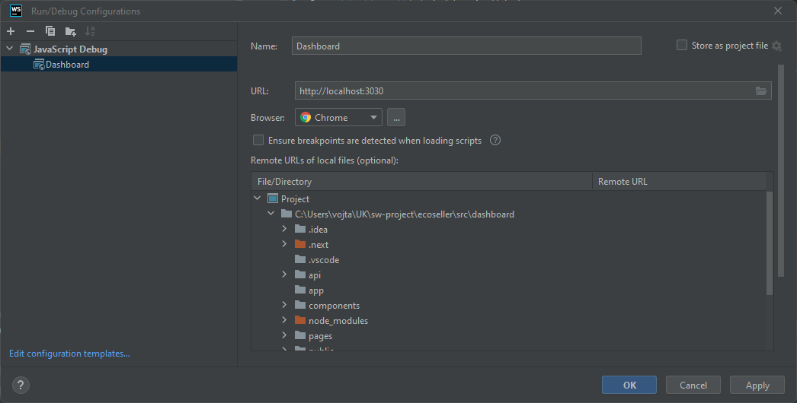

# Ecoseller dashboard

This folder contains Ecoseller backend app, written in [Next.js](https://nextjs.org/).  
This project is bootstrapped with [`create-next-app`](https://github.com/vercel/next.js/tree/canary/packages/create-next-app).

## Dev tools

### Debugging

#### Webstorm
1. Run dashboard app using `docker compose` or locally
2. Open [dashboard](.) folder in Webstorm
3. Select Run/debug configuration > Add New > Select *JavaScript Debug*
4. Use the URL, where the dashboard is running (see the example below)
    
5. Then, run debuging using *Debug* button in menu.   
(Also note that this way, you'll be able to debug client-side code 
only - therefore not e.g. `getServerSideProps` method)

### `eslint`
We use [ESLint integrated in Next.js](https://nextjs.org/docs/basic-features/eslint) for linting

Run
```shell
npm run lint
```
to check for warnings.

If there are any warnings, you can fix them automatically (if possible) by running:

```shell
npm run lint -- --fix 
```

### `prettier`
We use [prettier](https://prettier.io/) code formatter. 

Run

```shell
npm run format
```
to format source code files.
